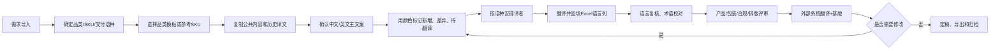
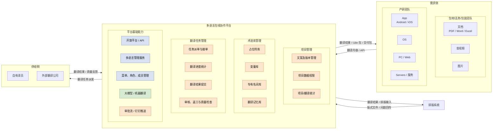
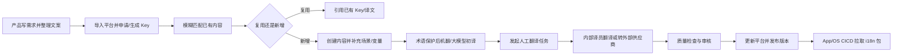

# 公司级多语言翻译平台需求文档

> 文档版本：v1.1
>
> 编制时间：2026-07-22
>
> 文档定位：公司级多语言翻译与协作平台的需求基线
>
> 适用范围：各业务线接入的说明书/包材、App、Web、服务端及其他多语言内容项目

## 文档说明

本文将现有材料统一整理为四个层次：

1. **现状**：记录已有系统、已上线能力、当前工作流和实际资料形态，不把规划能力误写成已实现能力。
2. **业务需求及痛点**：从产研、内部翻译团队、外部供应商、UGNAS 和包装文案组的视角归纳问题与目标。
3. **规划和方案**：明确公司级平台定位、共性底座、领域扩展、系统边界、分期路线和整合策略。
4. **具体需求**：形成可用于产品设计、研发、评审和验收的功能、数据、流程、接口、权限和非功能需求。

状态标记：`[已上线]`、`[已完成]`、`[规划中]`、`[现状痛点]`、`[待确认]`。其中“需求基线”表示已有业务需求或方案设计，不等同于已上线能力。

本文合并的主要依据：

- `多语言管理平台交互_update20220325.pdf`：通用多语言管理后台交互和功能参考。
- `公司级多语言协作平台需求分析及规划梳理 (1).docx`：公司层级的场景分析、平台架构和里程碑规划。
- 包装部门业务访谈：说明书翻译与排版痛点、任务指派、评审和复用需求。
- 文案组的充电器、无线充、移动电源多语言模板及术语表：当前资料、颜色规则、公共内容和翻译记忆现状。
- `UGNAS后台需求梳理.md`：NAS 团队既有多语言需求基线和已上线后台能力。
- `多语言管理功能 · 一期.docx`、`多语言管理功能 · 二期（导入智联App本地文案 及App本地文案在线更新能力）.docx`：AIoT 一期已完成能力和二期规划。

---

## 1. 现状

### 1.1 公司级业务场景全景

公司当前存在三类主要多语言场景。它们可以共享语言、术语、翻译、审核和版本底座，但内容粒度、协作对象和生效机制不同。下表中的 AIoT、UGNAS 和包装是当前接入方/业务线示例，不作为平台固定的项目类型。

| 场景 | 主要服务对象 | 当前代表系统/资料 | 内容对象 | 生效/交付方式 | 状态 |
| --- | --- | --- | --- | --- | --- |
| 产研多语言 | App、RN、H5、Web、服务端、云端配置 | AIoT 多语言一期/二期 | 项目、交付单元、Key、词条 ID、语言、变量、资源、版本 | 前端发布版本、CICD 拉包；后端 API 实时生效 | 一期已完成；二期规划中 |
| NAS/UGNAS 业务多语言 | App、后台、设备端、知识中心、版本发布 | UGNAS 后台多语言模块 | Key、交付单元、模块标签、语言任务、译文审核状态 | 导出、同步到业务系统或内容发布 | 既有需求基线，当前主要服务 NAS 团队 |
| 包装与物料多语言 | 包装、说明书、彩盒、菲林、包材和供应商 | Excel 模板、术语表、外部翻译排版系统 | 文档/资源型内容、品类模板、SKU、章节、句段、术语、图片、排版版本 | 项目定稿、排版文件、PDF/菲林/交付包 | 现状痛点，待平台化 |

### 1.2 已有系统和能力边界

公司级规划文档已识别出以下模块及建设状态：

| 模块 | 当前状态 | 现状说明 | 公司级平台中的定位 |
| --- | --- | --- | --- |
| 多语言管理服务 | [已上线] | 提供多语言数据管理、实时查询 API、i18n 文件生成和下载 | 统一数据与运行时服务底座 |
| 开放平台 | [已上线] | 已有接口及开放能力 | 对接 App、服务端、UGNAS 和未来包装系统 |
| 菜单、角色、成员管理 | [已上线] | 已有 Web 权限基础 | 公司级租户、项目、角色和数据权限 |
| 大模型/机器翻译 | [已外采] | 已具备外部翻译能力 | 统一接入，增加术语、变量和质量门禁 |
| 项目管理 | [规划中/待建设] | 需要管理项目、文案、版本、数据权限 | 公司的统一项目入口 |
| 术语库管理 | [规划中/待建设] | 专有名词、占位符、变量仍依赖 Excel 或分散维护 | 全公司可治理、可复用的语言资产 |
| 翻译任务管理 | [规划中/待建设] | 内外部翻译任务依赖人名、备注、Excel 或线下沟通 | 任务指派、作业、审核、催办和统计 |
| 审批流/钉钉推送 | [规划中/待建设] | 根据协作复杂度选择审批流或固定规则+通知 | 任务提醒、完成通知和异常升级 |
| 外部排版系统 | [外部协作工具] | 包装文案组使用外部供应商系统进行翻译+排版 | 通过适配器、任务包和结构化文件对接，不作为公司主数据源 |

### 1.3 UGNAS/NAS 后台多语言现状

#### 1.3.1 业务覆盖

UGNAS 的多语言需求不只服务说明书，而是覆盖软件、固件、应用、AI 模型、安装包同步、知识中心和设备端内容：

- 软件版本、固件版本：多语言版本描述和补充描述。
- 应用管理：应用名称、应用描述、安装协议等。
- AI 模型：选择语言、多语言名称、标签和模型描述。
- AI 模型下载、安装包同步：多语言标题、版本描述和补充信息。
- 知识中心：语言、国际化、翻译类型、批量翻译、机器翻译和预览。

#### 1.3.2 已上线/既有模块基线

UGNAS 后台已形成“多语言词条管理”模块，包含：

- 词条查询：按中文、Key、平台、模块、语言状态、创建人、时间等筛选；支持批量备注、删除、废弃、驳回、导出、发起翻译、查看状态和日志。
- 翻译任务管理：按 Key、平台、模块、语言 Code、译员等处理翻译任务；支持批量导入、导出、通过、不通过、开始翻译和开始审核。
- 模块管理：管理平台、模块名称、模块编码和关联词条数。
- 状态：已创建、待翻译、翻译中、待审核、审核通过、审核驳回、已发布、废弃；语言级有待翻译、待审核、通过、不通过。
- 角色：多语言管理员、翻译员、审核员；需要记录译员、审核人、期望返稿时间、审核意见和操作日志。

UGNAS 能力可作为公司级通用词条底座参考，但其平台/模块/Key 组织方式不能直接替代包装的品类/SKU/章节/句段和排版对象。当前平台也只适用于 NAS 团队，尚未形成公司级统一协作与数据治理。

### 1.4 AIoT 产研多语言现状

#### 1.4.1 一期已完成能力

按项目当前状态，AIoT 一期已完成的能力基线包括：

- 统一前后端多语言管理服务、Web 控制台和对外 API。
- 项目按前端项目/后端项目区分；按项目配置支持语种，不要求所有项目同时增加语言。
- 项目内 Key 唯一；平台生成全数据中心唯一的词条 ID，并支持独立版本记录。
- 前端项目使用最新版本/最新已发布版本；后端项目文案修改后可即时生效。
- 支持单条编辑、批量新增、批量更新、批量导入导出、按语种 JSON/i18n 压缩包生成。
- 支持项目支持语种、语言 Code、机翻 Code、用户显示名称等语言主数据。
- Web 表单通过 `🌐` 展开多语言配置组件，支持场景说明、场景图片和各语种文案。
- 支持单条和批量机翻；仅回填空白目标语种，不覆盖已有人工译文；支持术语/词典保护。
- 支持批量导出、批量机翻、批量更新任务及异步结果文件。
- 具备 iOS/Android 占位符、数字、百分号、引号、HTML 转义、换行和制表符规范。

#### 1.4.2 二期规划与当前进度

二期主线是导入智联 App 的 Android/iOS 存量文案和 Key，并接入 App CICD；预计 2026 年 8 月底完成。评审已确定：

- 产品负责统一 Android/iOS Key，研发负责导出现有文案，平台负责脚本导入。
- App 项目建议按“App 原生页面、不同品类 RN 页面、公共词条”划分。
- 2026 年 7 月 31 日输出统一后的 Key 和文案表格。
- 必填语言、资源类型、变量管理、App 项目导入、导入结果校验、发布包生成和 CICD 拉包属于 P0。
- App 原生/RN 文案在线更新、静默下载新包和重启后生效属于后续 P1，当前二期不包含完整在线更新闭环。

二期新增规则：

- 简体中文始终必填；项目必填语言只能是支持语言的子集；规则覆盖组件、编辑、API、导入、机翻和发布。
- 历史词条不自动补齐；编辑、批量更新和发布按最新必填语言规则校验；发布前缺失任一必填语言则阻断。
- 支持文本、图片、视频、富文本；图片/视频按语言维护 URL，不参与机翻，App 返回时只返回对应值。
- 变量机翻前解析和替换、机翻后校验和还原；单个 Key 最多 9 个变量；疑似变量未配置或变量缺失时阻断回填。
- 简体中文最多 1000 字符，目标语言译文最多 10000 字符。
- 增加项目默认语言，解决海外项目英文兜底问题。

### 1.5 包装说明书和包材多语言现状

#### 1.5.1 当前资料形态

文案组的充电器、无线充、移动电源模板及术语表共包含多个工作表，混合了通用模板、彩盒/说明书、插脚提示语、功率分配、故障处理、特殊款、历史版本、供应商页和修改记录。相同品类和 SKU 通过“参考某 SKU”、复制粘贴和共享盘查找完成复用。

当前资料存在以下特征：

- 公共章节、SKU 差异内容、历史旧版和供应商版本混在同一文件体系中。
- 中文/英文作为源文案，部分文件要求以英文列为准；语言列和语种数量不统一。
- 黄/粉色表示待翻译或待排版，红色表示新增/修改，绿色表示复制译文待复核，蓝色表示参考 SKU 差异。
- 译者姓名写在语言列标题或备注中，任务指派已经存在，但没有独立任务对象。
- 修改记录以 Excel 工作表维护，无法精确关联句段、语种、任务和版式位置。
- 术语表缺少术语 ID、定义、上下文、品类、市场、审核/废弃状态和版本生效时间；语言 Code 存在 JP/JA、KO/KR、ID/IND 等不统一。
- 图片通过 `DISPIMG` 或共享盘路径引用，跨环境、跨供应商协作容易失效。

#### 1.5.2 当前说明书翻译流程

外部供应商排版系统可承担翻译与排版协作，但当前应将其视为外部执行工具：项目、句段、译文版本、任务状态、评论和最终交付包仍需要在公司平台形成可追溯主记录。平台一期可采用 Excel/JSON/任务包导入导出，后续再评估在线接口或排版插件。

#### 1.5.3 现状断点

- 同品类结构和公共翻译无法稳定复用。
- 小语种质量不稳定，术语口径不一致，机器翻译缺少语境和变量保护。
- 翻译与排版脱节，出现文本溢出、换行、字体、图文和页数问题时反馈滞后。
- 评价和修改意见无法定位到句段或版式位置。
- 任务指派依赖语言列姓名和线下沟通，没有负责人、截止时间、逾期和转派。
- 颜色是唯一的状态信号，无法统计进度和影响范围。

### 1.6 公司级现状流程对比

| 环节 | AIoT/产研 | UGNAS | 包装/包材 |
| --- | --- | --- | --- |
| 文案来源 | 代码、i18n、产品表单、云端配置 | 后台业务字段、版本/知识中心内容 | Excel 模板、说明书、彩盒、图片和排版文件 |
| 内容标识 | 项目 + Key + 词条 ID | Key + 平台 + 模块 | 品类 + SKU + 章节 + 句段/资源 |
| 翻译触发 | 新增 Key、机翻、CICD/发布 | 发起翻译任务 | 需求导入、颜色标记、语言列分工 |
| 人工翻译 | 内部译员或后续供应商 | 翻译员、审核员 | 内部/供应商、按语种和章节协作 |
| 生效机制 | 前端发布版本；后端即时 | 审核后导出/同步 | 定稿后排版和交付 |
| 主要风险 | 发版依赖、Key/语言不一致、变量误翻 | 状态和数据权限分散 | 复用、质量、排版和协同不可追溯 |

### 1.7 现状结论

公司并不是从零建设多语言能力，而是已有三类资产：

1. AIoT 已上线的多语言管理服务、API、i18n 文件能力和项目版本机制。
2. UGNAS 已上线/已定义的词条、模块、翻译任务、审核状态和权限模型。
3. 包装组沉淀的品类模板、公共词条、历史译文、术语表和外部排版协作经验。

当前缺口不在于“有没有翻译工具”，而在于：数据模型没有统一、任务和质量闭环没有公司级治理、产研和包装的领域对象没有被同一平台的共性底座承接。

---

## 2. 业务需求及痛点

### 2.1 参与方与核心诉求

| 参与方 | 当前痛点 | 业务目标 |
| --- | --- | --- |
| 产研产品团队 | 文案写死在代码或配置中；新增/修改依赖研发和发版；配置交给翻译后容易遗漏 | 文案与代码解耦，Key 统一，提交后先有 AI/机翻结果，人工校对后自动回写，必要时支持在线更新 |
| 前端/服务端研发 | Key、语言 Code、i18n 文件来源不统一；集成包需要等待翻译；运行时查询能力不足 | 提供稳定 API、最新/已发布版本包、CICD 集成和后端实时查询 |
| 内部翻译团队 | 术语、占位符和变量依赖 Excel；缺少语境、截图、长度限制；重复翻译 | 在线术语库、翻译记忆、上下文和质量检查，支持任务领取/转派/审核 |
| 外部翻译供应商 | 通过 Excel/文件接收任务，版本和反馈分散 | 可按权限接收任务包或登录平台作业，提交后进入统一审核和结算记录 |
| UGNAS/NAS 团队 | 有词条和翻译任务，但能力主要服务单一团队，模块和状态体系未公司化 | 复用通用 Key、平台、模块、语言、任务和审核底座，保持 NAS 业务兼容 |
| 包装文案组 | 公共结构/词条无法复用；小语种质量不一致；排版和翻译脱节；意见无法在原文档定位 | 品类模板、SKU 继承、句段级任务、术语/记忆库、排版预览、评论和交付包 |
| 设计/排版团队 | 译文长度、字体、换行、图片和页数风险在排版阶段才暴露 | 在翻译阶段获得长度和版式风险提示，支持结构化导入和排版结果回传 |
| 项目/翻译管理员 | 任务进度、逾期、供应商质量和成本无法统计 | 任务看板、通知、质量指标、审计和项目数据权限 |

### 2.2 公司级共性业务需求

- 建立统一语言主数据、语言 Code、地区变体、默认语言和项目必填语言规则。
- 建立可复用的 Key/词条/句段/资源模型，支持完全匹配、相似匹配、引用和来源追踪。
- 建立术语库、变量库、占位符规范和翻译记忆库，贯穿 AI/机翻、人工翻译、审核和发布。
- 将翻译任务从“语言列/备注/线下人名”升级为独立任务，支持指派、领取、转派、退回、返工、截止时间、逾期和进度。
- 提供翻译工作台和上下文：源文案、截图/场景说明、变量、长度约束、参考译文、术语提示和历史版本。
- 形成质量门禁：漏译、术语、数字/单位、型号、占位符、禁用词、HTML/格式和媒体资源检查。
- 将审核、评论、修改意见和发布绑定到具体 Key/句段/语种/版本，避免意见散落在 Excel、颜色和聊天记录中。
- 支持 API、i18n 文件、Excel/CSV/JSON、包装任务包和外部排版系统适配。
- 对所有变更形成版本快照、来源、影响范围、操作者和时间的审计记录。

### 2.3 领域差异化需求

#### 2.3.1 产研领域

- 以项目、Key 和词条 ID 为核心，支持前端版本发布与后端即时查询。
- 需要代码/文案解耦、批量申请 Key、模糊匹配、CICD 拉取和在线更新。
- 文案常带 `%1$s`、`${variable}`、`{name}` 等变量，需要机翻前后保护。
- 图片、视频和富文本等资源需要按语言返回 URL 或内容。

#### 2.3.2 UGNAS 领域

- 兼容平台、模块、客户端、版本、知识中心等业务字段。
- 兼容已有词条状态、语言状态、翻译任务、批量导入导出和审核流程。
- 允许 NAS 团队继续按现有模块运作，同时逐步接入公司级语言、术语、权限和日志。

#### 2.3.3 包装/包材领域

- 以品类模板、SKU、章节、模块、句段和交付物为核心，不能只用 Key 表示全部关系。
- 支持公共内容、参考 SKU、继承关系、差异识别、供应商和排版版本。
- 支持按语种/章节指派任务、翻译复核、评论、版式预览和 PDF/菲林交付。
- 支持文本、图片、图示、附件、版式位置和印前检查。

### 2.4 跨域整合原则

1. **一套共性底座，多种交付载体适配**：统一用户、业务线/组织、项目、语言、术语、任务、质量、审核、版本和日志；Key/资源型与文档/排版型按交付单元加载差异化对象。
2. **不强行统一业务粒度**：不同接入系统的 Key、平台、模块、客户端等字段，以及包装的品类、SKU、章节、句段可以作为来源元数据或可配置标签保留，不要求变成同一个固定层级。
3. **一处维护主数据，按交付单元发布**：语言、术语和变量是公司级/组织级资产；项目文案、Key、句段和业务字段保留各自版本及发布节奏。
4. **保留已有系统兼容性**：AIoT API/i18n 包、UGNAS 字段和外部排版任务包均可继续使用，通过适配层接入。
5. **翻译结果与机器结果分层**：机器/大模型结果只能作为初稿，人工译文、审核状态和定稿版本必须可追溯。
6. **默认最小权限**：业务线/组织、项目、交付单元、语言、内容空间和供应商数据按授权范围隔离；平台/模块等内部字段不自动成为权限层级。

### 2.5 业务成功指标

首期建议建立以下指标基线，具体目标值由试点项目确认：

- 公共术语/句段/翻译记忆复用率。
- 新增 Key/句段从提交到可用的平均时长。
- 机器初译后的人工返工率和审核通过率。
- 漏译、术语错误、变量错误、数字/单位错误数量。
- 翻译任务按期完成率、逾期率、转派率和返工率。
- 包装排版溢出、字体缺失、图文不匹配和页数变更问题数。
- 产研因翻译等待导致的发版延期次数。
- 多语言 API 成功率、响应时延和 i18n 包构建成功率。

---

## 3. 规划和方案

### 3.1 产品定位

公司级多语言平台定位为“多语言内容资产与协作交付平台”，而不是单纯的在线翻译工具或某一个团队的词条后台。平台应同时承接：

- **内容资产层**：语言、术语、变量、翻译记忆、Key、句段、资源和版本。
- **协作流程层**：项目、任务指派、翻译工作台、质量检查、审核、评论、通知和供应商协作。
- **交付服务层**：API、i18n 文件包、CICD、UGNAS 同步、包装结构化交付和外部排版适配。

### 3.2 总体架构方案

总体架构按“需求侧—多语言在线协作平台—供给侧”组织，并将排版系统作为上层交付系统接入。需求侧保留不同业务方的输入形态，平台内部统一管理内容、术语、任务、质量和版本，供给侧承接内部译员和外部翻译公司。

#### 3.2.1 架构分区说明

| 区域 | 包含对象 | 主要输入 | 主要输出 |
| --- | --- | --- | --- |
| 需求侧—包装/包材 | 包材、法务、包装团队；文档、音视频、图片 | PDF、Word、Excel、图片/视频、产品资料 | 结构化句段、语种需求、排版输入 |
| 需求侧—产研 | App、OS、PC/Web、Servers | 代码/i18n 文件、产品表单、服务端配置、Key 申请 | Key、默认文案、API 查询、i18n 构建包 |
| 平台—项目管理 | 文案及版本、项目数据权限、翻译统计 | 各领域项目及内容 | 项目版本、权限范围、进度数据 |
| 平台—术语库管理 | 占位符库、变量库、专有名词库、翻译记忆库 | 公司/领域/项目语言资产 | 机翻保护、译文推荐、质量规则 |
| 平台—翻译任务管理 | 任务派单接单、进度统计、结果提交、审核返工 | 待翻译内容和目标语种 | 译文、审核结果、任务状态、质量反馈 |
| 平台—基础能力 | 开放平台、多语言管理服务、权限、通知、机器翻译 | API 请求、异步任务、翻译服务 | 实时查询、i18n 包、任务包、通知 |
| 供给侧 | 自有译员、外部翻译公司 | 平台派发的语种/范围任务 | 翻译结果、质量意见、交付文件 |
| 上层排版系统 | 外部供应商排版或内部排版工具 | 结构化译文、图片、版式约束 | 排版文件、预览图、溢出/换行问题和最终交付包 |

#### 3.2.2 建设状态图例

| 状态 | 含义 | 对应模块 |
| --- | --- | --- |
| 蓝色 `[已具备]` | 当前已有能力，可复用或改造 | 开放平台、多语言管理服务、菜单/角色/成员管理 |
| 橙色 `[待建设]` | 公司级平台需要新增建设 | 项目管理、术语库、变量库、翻译任务、审核、通知 |
| 绿色 `[已外采]` | 外部已有能力，通过适配层接入并受平台治理 | 大模型/机器翻译 |

#### 3.2.3 平台模块建设策略

| 模块 | 方案 | 初始状态/计划 |
| --- | --- | --- |
| 项目管理 | 项目、归属业务线/组织、交付单元、内容形态、支持语言、默认/必填语言、数据权限、版本策略和交付物 | P0 建设；通过配置兼容不同业务线和接入载体 |
| 内容管理 | Key/词条、句段、资源、场景、来源、内容空间、引用、继承和差异 | P0 建设；包装扩展字段在 P1 |
| 术语库 | 术语 ID、语言、地区、定义、上下文、禁译词、审核状态和版本 | P0 建设 |
| 变量/占位符库 | 匹配规则、变量类型、示例、业务说明、启用状态 | P0 建设，先满足 AIoT |
| 翻译记忆 | 完全匹配、相似匹配、来源项目、品类、市场、审核状态 | P1 建设，包装优先试点 |
| 翻译任务 | 语种/章节/句段拆分、指派、截止时间、转派、返工、逾期和进度 | P0 建设 |
| 翻译工作台 | 上下文、截图、术语提示、变量、长度限制、参考译文、历史版本 | P0/P1 分期 |
| 质量检查 | 语言、术语、数字、变量、格式、媒体和排版检查 | P0 文本质量；P1 排版联动 |
| 审核/评论 | 语言审核、产品审核、合规审核、排版审核、句段/页面评论 | P0 任务审核；P1 版式评论 |
| 开放平台 | Key/词条、语言、i18n 包、实时查询、导入导出和回调 API | 已有能力，统一鉴权与版本规范 |
| 菜单/角色/成员 | 公司、团队、项目、语言和供应商的数据权限 | 已有基础，扩展跨域权限 |
| 机器翻译/大模型 | 通过适配层接入，严格经过术语/变量保护和人工审核 | 已外采，平台治理 |
| 通知/审批 | 固定规则优先，复杂流程再接审批流；支持钉钉/站内消息 | P0 通知；后续可配置审批 |
| 资产与排版适配 | 图片、视频、文档、字体、结构化文案包和外部排版回传 | P1 包装扩展 |

### 3.3 统一数据模型与领域扩展

#### 3.3.1 共性对象

| 对象 | 关键字段 | 适用场景 |
| --- | --- | --- |
| 项目 | 项目 ID、名称、归属业务线/组织、关联项目组、单一交付单元、支持/默认/必填语言、负责人、权限、版本策略 | 全部 |
| 交付单元 | 交付单元 ID、载体（说明书/App/Web/服务端等）、内容形态、来源连接器、发布方式和项目进度；与项目一对一 | 全部 |
| 内容空间 | 产品/系统或长期维护的内容来源、接入方式、负责人和可关联项目 | 全部 |
| 关联项目组 | 可选的跨项目汇总关系，例如同一需求批次下的 App、Web、服务端或说明书、包材项目；不承载流程和权限 | 全部 |
| 内容单元 | Key/句段 ID、源文案、资源类型、上下文、来源、内容空间、引用关系、删除/废弃状态 | 全部 |
| 语言版本 | 语言 Code、地区、译文/URL、状态、译员、审核人、更新时间 | 全部 |
| 术语 | 术语 ID、源词、目标词、定义、上下文、品类/模块、审核和生效版本 | 全部 |
| 变量模板 | 名称、类型、匹配规则、示例、业务说明、启用状态 | 产研优先，包装可复用 |
| 翻译任务 | 任务 ID、范围、语种、负责人、供应商、截止时间、状态、质量结果 | 全部 |
| 审核记录 | 审核类型、版本、意见、处理人、结果、时间 | 全部 |
| 交付版本 | 版本号、范围、状态、发布时间、包地址、来源快照 | 产研/包装 |
| 操作日志 | 操作对象、前后值、操作者、时间、来源、影响范围 | 全部 |

#### 3.3.2 交付载体扩展对象

平台不将 AIoT、UGNAS 等业务线固化为项目类型，而是根据交付载体加载扩展字段和工作流：

- **Key/资源型交付单元**：适用于 App、Web、服务端、后台等，支持 Key、词条 ID、资源文件、API 路径、变量、CICD 和发布批次；原有平台/模块/客户端等字段作为可配置标签或接入系统元数据保留。
- **文档/排版型交付单元**：适用于说明书、包材、彩盒等，支持品类、SKU、模板、章节/模块、句段、图片/附件、排版页、版式约束、印刷批次和供应商。
- **关联项目组**：当同一需求批次需要覆盖多个载体时，分别创建 App、Web、服务端或说明书、包材项目，再通过可选的关联项目组汇总查看；各项目独立配置内容源、任务、审核、权限和发布方式。

#### 3.3.3 组织与业务线对象

- **业务线/组织空间**：用于用户、角色、组织架构、数据权限、默认负责人、审批链和资产可见范围；AIoT、UGNAS、包装只是可配置的当前接入方名称。
- **项目**：一次具体的翻译、审核、发布或交付活动，且只对应一个交付单元；设置归属业务线和协作组织，但不承担平台、模块等业务内部层级。
- **关联项目组**：可选地把同一需求批次或产品发布中的多个独立项目关联起来，只用于汇总进度、跳转和共享背景，不改变项目边界。
- **项目范围**：项目引用一个内容空间、源版本、内容集合和目标语言；需要覆盖多个载体时拆分为多个项目，通过关联项目组汇总。

#### 3.3.3 状态映射

通用状态建议采用：`草稿` → `待翻译` → `翻译中` → `待审核` → `审核驳回/返工` → `审核通过` → `待发布` → `已发布`，并允许 `已废弃`。领域状态通过映射实现：

- AIoT：项目版本发布或后端即时生效。
- UGNAS：语言状态/词条状态与既有后台兼容。
- 包装：句段翻译完成、语言审核、排版通过、项目定稿和交付完成。

### 3.4 三类业务的目标流程

#### 3.4.1 App/OS/产研新增文案

#### 3.4.2 后台配置文案

#### 3.4.3 包装说明书/包材

### 3.5 系统整合与外部系统策略

#### 3.5.1 AIoT 接入

- 保留一期已有的项目、Key、词条 ID 和版本接口。
- 二期接入智联 App 存量导入、统一 Key、项目发布包和 App CICD 拉包。
- 在线更新作为 P1 单独建设，需定义缓存、静默下载、重启生效和回滚策略。
- API 需支持最新版本、最新已发布版本、按项目/语种批量查询、项目语言列表和 Key 列表。

#### 3.5.2 UGNAS 接入

- 通过项目/平台/模块映射兼容现有 Key 和语言状态。
- 支持已有 Excel 批量导入导出、翻译任务、审核、废弃和操作日志。
- 先保持 NAS 团队独立数据权限，再逐步接入公司级术语、语言主数据和任务中心。

#### 3.5.3 包装与外部排版系统接入

- 公司平台保存项目、模板、句段、译文、任务、审核和交付版本主记录。
- 一期采用结构化 Excel/CSV/JSON/任务包导入导出，保留稳定句段 ID、语言 Code、状态和版本。
- 外部排版系统返回排版文件、预览图、问题清单和版本号，平台记录回传关系。
- 后续根据外部系统能力评估 API、插件、在线预览或自动回传；不在未确认接口前假设可直接控制其内部排版。

### 3.6 分期路线与里程碑

| 阶段 | 目标 | 主要内容 | 交付状态 |
| --- | --- | --- | --- |
| 0. 既有能力沉淀 | 复用已上线能力 | AIoT 多语言服务、开放平台、RBAC、机器翻译、UGNAS 词条/任务基线 | 已有 |
| 1. 基础功能搭建 | 建成公司级协作底座 | 项目管理、文案/版本管理、数据权限、术语库、变量库、翻译任务、通知和质量基础 | 规划中 |
| 2. 客户端接入验证 | 完成智联 App 接入 | 统一 Android/iOS Key、存量数据导入、CICD 拉包、必填语言、资源和变量规则 | 预计 2026 年 8 月底完成二期主线 |
| 3. 领域扩展试点 | 打通包装和 UGNAS | 一个充电产品 SKU 包装试点；UGNAS 迁移/适配；排版任务包和评论闭环 | 规划中 |
| 4. 更多客户端接入 | 扩大产研覆盖 | 绿联声学等客户端接入；App/RN 在线更新；更多 Web/服务端项目 | 后续规划 |

### 3.7 建议的治理方式

- **公司级语言主数据**：统一标准 Code、地区变体、显示名称和机翻 Code；项目只选择适用语种。
- **业务线/组织权限**：业务线只承担用户、角色、组织架构、数据范围、审批链和资产可见范围；项目流程由交付单元和内容形态决定。
- **术语分层**：公司通用术语、领域术语、项目术语；新版本和废弃版本均保留历史。
- **内容归属**：源文案由业务方负责，机器初译由系统生成，人工译文由译员负责，审核结果由审核角色负责，发布由项目负责人负责。
- **跨域复用**：完全匹配且已审核的术语/译文可推荐或引用；包装历史定稿、AIoT 发布版本和 UGNAS 发布内容保留快照，不被公共库变更反向覆盖。
- **供应商协作**：先任务包/导入导出，待权限、结算和数据隔离成熟后再开放供应商账号在线作业。
- **试点顺序**：先用智联 App 验证 Key/版本/CICD，再用一个充电产品 SKU 验证模板/句段/排版，最后扩展 UGNAS 和更多客户端。

---

## 4. 具体需求

本章包含公司级共性需求、现有接入方兼容需求以及文档/排版型扩展需求。优先级：`P0` 为首期必须具备，`P1` 为一期后或交付单元试点必需，`P2` 为后续增强。

### 4.0 需求分层与通用规则

#### 4.0.1 项目与交付单元

平台采用统一的“多语言项目”模型，不将 AIoT、UGNAS 或其他业务线固化为项目类型。新建项目时配置以下维度：

- **归属业务线/组织**：用于权限、角色、数据范围和责任归属；名称可由管理员维护。
- **交付单元**：说明书、包材、App、Web、服务端、后台或其他可扩展载体，每个项目只能选择一个；需要多个载体时分别创建项目。
- **内容形态**：文档/段落、Key-Value、结构化资源、媒体资源或混合内容。
- **内容空间/来源**：文件、Git、API、CMS、外部系统或在线录入；同一内容空间可被多个项目按版本引用。
- **关联项目组**：可选，关联同一需求批次下的多个项目；不继承项目状态、任务和权限。
- **工作流模板**：根据交付单元和内容形态选择，如“翻译—审核—排版—交付”或“翻译—复核—发布”。业务线只提供默认值，不决定项目页面和数据结构。

项目范围由“单一交付单元 × 内容空间/版本 × 内容集合 × 目标语言”组成。项目独立统计、派发任务和发布；关联项目组只提供跨项目汇总，不合并项目成员、任务、状态或交付物。

#### 4.0.2 内容类型

- 文本：普通字符串、多行文案、带变量文案。
- 富文本：HTML 内容，需保留标签和安全规则。
- 图片：PNG/JPG/GIF 等按语种的资源 URL。
- 视频：MP4/MOV/AVI/WMV 等按语种的资源 URL。
- 包装资源：图片、图示、附件、字体、版式文件、预览图和 PDF/菲林交付物。

#### 4.0.3 通用必填与发布规则

- 项目支持语言、默认语言和必填语言可配置；必填语言必须是支持语言的子集。
- 简体中文作为主语言始终必填；海外项目可配置英文为默认兜底语言。
- 必填规则覆盖组件、单条编辑、API、批量导入、机翻和发布。
- 历史内容不因规则变更自动补齐，但编辑、批量更新和发布时按最新规则校验。
- 前端项目发布前扫描本版本；任一必填语言缺失则阻断并输出缺失清单。
- 后端项目保存/生效时校验业务要求的必填语言。

#### 4.0.4 通用验收基线

- 可创建项目并配置语言、默认语言、必填语言、负责人和数据权限。
- 可创建/导入内容单元，保留稳定 ID、来源、上下文、资源类型和版本。
- 可复用已审核术语、译文和参考内容，并看到来源和差异。
- 可按语种、章节、模块或句段生成任务，完成指派、转派、退回和逾期提醒。
- 翻译提交前可执行术语、数字、变量、漏译和格式检查。
- 审核意见定位到对象和版本，返工后可重新审核和关闭。
- API、i18n 包、Excel/JSON 和包装任务包导入导出后不丢失 ID、语言和状态。
- 所有关键操作可审计，权限越权和跨项目访问被阻断。

### 4.1 角色与权限

#### 4.1.1 角色类型

交互稿中出现的角色包括：

- 企业管理员：具备项目内所有权限。
- 授权管理员：具备权限管理、项目管理相关权限。
- 操作人员：具备具体业务操作权限，权限说明待产品定义。
- 运营管理员：具备运营相关操作权限，权限说明待产品定义。
- 项目管理员、系统管理员、审核专员、编辑者、查看者：出现在角色权限矩阵中，具体权限项待产品定义。

#### 4.1.2 权限控制原则

- 用户只能看到自己有权限访问的功能、项目和内容。
- 用户无某功能权限时，对应入口、按钮、内容均隐藏。
- 用户无某项目权限时，对应项目卡片和项目详情不可见。
- 用户登录后若所有功能权限均为空，首页展示固定无权限空态：“暂无相关功能使用权限”。
- 审核权限需支持语种维度控制；审核列表仅展示用户有审核权限的语种。

### 4.2 信息架构

平台包含以下一级区域：

- 工作台：平台概览、当前用户负责的项目、待办、逾期和阻塞。
- 项目中心：平级展示所有多语言项目，按业务线/组织、交付单元、内容形态、状态和负责人筛选。
- 语言资产中心：模板库、术语库、翻译记忆库、公共文案库、变量/占位符库。
- 任务中心：跨项目查看翻译、复核、排版、评审和发布任务。
- 权限与组织：组织架构、业务线/组织空间、成员、角色、项目范围和语种权限。
- 系统设置：语言主数据、工作流模板、质量规则、连接器、通知、审计和数据保留。

项目详情采用统一骨架，按交付单元动态加载内容页面：

- 项目概览：项目基本信息、归属业务线、交付单元、内容来源、语言、进度和项目资产摘要。
- 源内容：维护当前项目的源文案/源 Key、内容空间同步、源版本、变更差异和冻结状态。
- 翻译内容：文档段落、Key/词条、资源或其他内容形态的目标语言工作区。
- 翻译任务：按交付单元、内容范围、语种和角色生成与指派任务。
- 项目语言资产：查看项目引用的模板、术语、翻译记忆、公共文案和变量。
- 评审与发布/交付：按交付单元加载软件发布、内容发布或包装定稿交付流程；文档型项目额外提供排版协同。

### 4.3 通用后台要求

#### 4.3.1 顶部信息

- 页面顶部展示平台名称、当前语言、当前登录用户。
- 当前语言支持简体中文和 English 切换；切换范围和多语言资源来源待确认。

#### 4.3.2 分页

- 普通列表默认每页 10 条。
- 批量导入详情列表默认每页 20 条。
- 分页需展示当前页、可跳转页码、每页条数、前往页和总条数。

#### 4.3.3 搜索

- 文案库、审核、权限成员等列表需支持关键字搜索。
- 文案库搜索支持键或文案内容模糊搜索。
- 审核搜索支持关键词搜索表格内容。

#### 4.3.4 弹窗与二次确认

- 删除、批量通过、批量驳回等高风险操作需二次确认。
- 二次确认需说明操作影响，例如“删除后可能影响引用页面显示，请谨慎操作”。
- 审核通过或驳回后结果不可撤回。

### 4.4 工作台与项目中心

#### 4.4.1 项目卡片列表

项目中心以卡片或表格形式展示用户有权限访问的平级项目，不使用“产品空间—领域子项目”的固定层级。

项目卡片展示字段：

| 字段 | 说明 |
| --- | --- |
| 项目名称 | 展示项目名称 |
| 业务线/组织 | 显示归属业务线和协作组织，用于权限和统计，不决定项目流程 |
| 交付单元 | 说明书、包材、App、Web、服务端等，单个项目只显示一个 |
| 关联项目组 | 可选的需求批次/产品发布关联，用于跨项目汇总和快速跳转 |
| 内容形态 | 文档/段落、Key/资源、结构化数据或混合 |
| 已翻译/进度 | 按项目范围和目标语言统计 |
| 项目语种 | 项目支持、默认和必填语言 |
| 当前阶段 | 根据项目工作流显示翻译、审核、排版、发布或交付阶段 |
| 查看详情 | 点击进入项目详情-项目概况 |
| 编辑入口 | 点击呼出编辑项目弹窗 |

排序规则：

- 项目卡片按项目新增时间倒序排列。

交互规则：

- 点击“查看详情”进入项目详情页。
- 点击项目编辑入口打开编辑项目弹窗。
- 无权限项目不展示。

#### 4.4.2 新增项目

入口：

- 点击项目中心“新建项目”按钮，打开新增项目弹窗。

表单字段：

| 字段 | 必填 | 规则 |
| --- | --- | --- |
| 项目名称 | 是 | 点击输入框获取焦点，输入项目名称 |
| 归属业务线/组织 | 是 | 从有权限的组织空间中选择；可配置协作组织 |
| 交付单元 | 是 | 单选说明书、包材、App、Web、服务端等；已有内容后不可直接切换，需新建项目 |
| 内容形态 | 是 | 根据交付单元选择文档/段落、Key-Value、结构化资源或混合 |
| 内容来源/内容空间 | 否 | 选择文件、Git、API、CMS、外部系统或在线录入 |
| 关联项目组 | 否 | 选择已有需求批次/产品发布关联；不改变项目权限和流程 |
| 项目语言 | 是 | 语种复选框，至少勾选 1 个，默认不勾选 |
| 工作流模板 | 是 | 根据交付单元推荐；支持项目级调整 |
| 备注 | 否 | 最多 500 字 |

按钮规则：

- 表单未按规则填写完成时，“确定”置灰不可点击。
- 表单填写完成后，“确定”高亮可点击。
- 点击“确定”后关闭弹窗并生成项目卡片。
- 点击“取消”关闭弹窗，不保存数据。

#### 4.4.3 编辑项目

入口：

- 点击项目卡片编辑入口，打开编辑项目弹窗。

表单规则：

- 支持编辑项目名称、归属业务线/组织、关联项目组、交付单元、内容形态、内容来源、项目语言、工作流模板和备注。
- 项目已有内容、任务或交付记录后，不允许直接切换交付单元；需复制项目基础配置并新建目标交付单元项目。
- 若编辑时取消已配置语种：
  - 前端页面不再展示该语种信息。
  - 用户无法新增或编辑该语种文案。
  - 该语种历史数据仍保留，不删除。

#### 4.4.4 首页文案导出

入口：

- 点击首页“文案导出”打开导出弹窗。

导出配置：

| 配置项 | 规则 |
| --- | --- |
| 选择要导出项目 | 必选，默认不勾选 |
| 选择要导出语言 | 必选，默认不勾选 |
| 选择要导出格式 | 支持 Excel、XML、JSON |
| 选择替换格式 | 具体选项交互稿未明确，待确认 |
| 选择指定内容 | 支持按标签指定内容 |
| 选择导出内容状态 | 支持待审核、已上线 |

按钮规则：

- 未勾选项目或语言时，“导出”置灰不可点击。
- 具体可导出字段以产品定义为准。
- 导出内容为最新记录文案。
- 状态说明支持鼠标 hover 展示 tips。

待确认：

- “选择替换格式”的业务含义和选项。
- 导出字段范围和格式样例。
- 是否支持跨项目批量导出同名 key 的合并或去重。

#### 4.4.5 源内容管理

源内容是项目翻译的受控输入，不等同于语言资产中心的公共文案。项目可以从文件、Git、API、CMS 或在线录入获取源内容，并在项目内形成源版本快照。

页面入口：

- 项目详情一级页签“源内容”。
- 项目概览展示当前源版本、最近同步时间、待确认变更数量，并可进入源内容页。

页面功能：

| 功能 | 说明 |
| --- | --- |
| 导入/同步源内容 | 从内容空间、文件、Git、API 或 CMS 拉取内容；保留来源、批次和同步日志 |
| 源内容编辑 | 编辑源文案/源 Key、上下文、章节/模块、变量、图片或参数；保留修改人和修改原因 |
| 源版本 | 创建草稿版本、查看版本差异、提交确认、冻结版本和归档历史版本 |
| 变更影响分析 | 对比当前源版本与上一版本，列出新增、修改、删除内容及受影响语言、任务、排版页和交付版本 |
| 变更任务 | 源内容冻结后，新增/修改内容自动生成翻译、复核和必要的排版返工任务；删除内容进入废弃流程，不直接删除历史译文 |
| 公共文案引用 | 可引用语言资产中心的公共文案作为源内容，但项目内保存引用版本和项目差异，不直接修改公共资产 |
| 发布前门禁 | 未确认源内容、存在未处理源变更或源版本与交付版本不一致时，禁止创建正式交付版本 |

源内容状态：`草稿`、`待确认`、`已冻结`、`有变更`、`已归档`。

版本规则：

- 源版本与翻译/交付版本分开编号；源内容冻结后才允许生成正式翻译任务。
- 项目源内容版本示例：`SRC-1.0`、`SRC-1.1`；正式交付版本示例：`v1.0`、`v1.1`。
- 源内容变更只重新打开受影响的内容项，未受影响的已审核译文继续沿用。
- 每个交付版本必须记录源版本、语言资产版本、任务结果、审核记录、排版文件或资源包地址。

### 4.5 项目概况

#### 4.5.1 概览模块

项目概况页展示项目整体翻译进度、各语种翻译进度和字符检查统计。

#### 4.5.2 全部文案概览

展示字段：

| 字段 | 说明 |
| --- | --- |
| 累计键词数 | 项目的键词总量 |
| 已翻译 | 全部语言都已翻译的键词数占总键词数的比例 |
| 未翻译 | 任一语言未翻译的键词数 |

交互规则：

- 点击统计数据区域，进入文案库页并自动带入对应筛选条件。
- 点击“未翻译”时，筛选“全部语言 - 未翻译”。

#### 4.5.3 语种概览

展示规则：

- 根据项目配置的语种动态展示语种卡片。
- 每个语种展示该语种已翻译比例和未翻译数量。

字段定义：

| 字段 | 说明 |
| --- | --- |
| 已翻译 | 有该语种文案的键词数占总键词数的比例 |
| 未翻译 | 没有该语种文案的键词数 |

交互规则：

- 点击语种统计数据，进入文案库并筛选当前语种的翻译状态。
- 例如点击俄文未翻译，进入文案库并筛选“俄文 - 未翻译”。

#### 4.5.4 字符检查

展示固定检查维度：

- 标记待处理数。
- 检查存在异常数。
- 检查存在未引用数。

交互规则：

- 点击统计项进入文案库，并按对应标签或状态筛选。
- 排序规则：按数量从大到小排序；数量相同时按标签 ID 排序。

待确认：

- 字符检查维度是否允许用户自定义。
- “存在异常”的具体校验规则。
- “待处理”是标签、文案状态还是人工标记。

### 4.6 项目文案库

#### 4.6.1 文案列表

文案库列表展示项目下所有键词及各语种文案。

列表字段：

| 字段 | 说明 |
| --- | --- |
| 键 | 文案 key |
| 各语种文案 | 根据项目配置语种动态展示，例如简体中文、英文、韩文、俄文、台湾正体、港澳繁体 |
| 上线状态 | 已上线、待审核 |
| 更新时间 | 最近更新时间 |
| 操作 | 查看、编辑、删除 |

列表交互：

- 支持拖拽表头分割线调整字段显示宽度。
- 鼠标移入内容字段时展示完整文本浮层，浮层最长不超过屏幕宽度的四分之一。
- 鼠标移出后浮层消失。
- 点击内容字段可复制内容，并显示“复制成功”toast。
- 点击键值可呼出该键查看侧边栏。

#### 4.6.2 文案筛选

文案库支持以下筛选：

| 筛选项 | 规则 |
| --- | --- |
| 语言翻译状态 | 支持语言筛选及翻译状态筛选 |
| 上线状态 | 全部、已上线、待审核 |
| 标签 | 全部、无标签、已配置标签 |
| 文案状态 | 全部、有异常的键、无异常的键 |
| 引用状态 | 全部、已被引用、未被引用 |
| 更新时间 | 支持开始日期和结束日期 |
| 搜索 | 支持键或文案内容模糊搜索 |

语言翻译状态规则：

- “全部语言”可选择“全部翻译状态”。
- 单语种筛选不展示“全部翻译状态”选项。
- 可选语种基于项目配置的语种动态展示。

标签筛选规则：

- 固定选项包含“全部”和“无标签”。
- 其余筛选项来自已配置标签。

#### 4.6.3 新增文案

入口：

- 点击文案库“新增文案”进入新增文案页。

页面标签：

- 文案配置。
- 文案信息。
- 相关文案。
- 历史。

文案配置字段：

| 字段 | 规则 |
| --- | --- |
| 键 | 支持添加键；添加前需查重，重复时报错“已有该键值” |
| 各语种文案 | 根据项目配置语种动态展示输入框 |
| 引用其他键词 | 可从其他项目库引用已有文案 |

保存规则：

- 至少填写一个语种文案，否则“保存”置灰不可点击。
- 异常文本校验不阻塞保存。

键字段规则：

- 点击“添加”显示键输入框。
- 输入 key 后回车确认。
- 新增 key 需查重校验，重复不可添加。
- key 添加后不可删除、不可修改。
- 若引用了其他键词，被引用键值直接添加到该字段。

#### 4.6.4 文案信息

文案信息包含：

- 描述。
- 上下文。
- 图示。
- 标签。
- 涉及的功能/业务。

上下文规则：

- 可添加描述和图片。
- 图片支持 png、jpg、jpeg。
- 单个文件不超过 5M。
- 输入内容后支持实时检索相似或相同内容。
- 有匹配内容时直接呼出浮窗。
- 输入框失焦时浮窗消失，重新获焦时再次显示。
- 上下文列表按添加时间倒序显示。
- 点击“应用”后绑定到当前文案，按钮变为“取消应用”。
- 点击“取消应用”解除绑定。
- 应用或取消应用不会关闭弹窗。
- 弹窗仅可通过右上角 X 关闭。

标签规则：

- 支持添加并应用标签。
- 输入内容后实时检索相似或相同标签。
- 标签列表按添加时间倒序显示。
- 点击“应用”绑定标签，点击“取消应用”解除绑定。
- 弹窗仅可通过右上角 X 关闭。
- 已绑定标签在文案信息区域展示，可点击 X 解除应用；解除不影响标签库本身。

涉及功能/业务规则：

- 支持添加并应用功能/业务。
- 输入内容后实时检索相似或相同内容。
- 功能/业务列表按添加时间倒序显示。
- 点击“应用”绑定，点击“取消应用”解除绑定。
- 弹窗仅可通过右上角 X 关闭。

#### 4.6.5 引用其他键词

入口：

- 点击“引用其他键词”打开引用弹窗。

规则：

- 用户输入键词。
- 输入框失焦时检索全部项目库。
- 若未找到文案，下方展示“暂无此键文案”。
- 若找到文案，展示对应文案内容及所属项目名称。
- 点击“确定”关闭弹窗并完成引用。

待确认：

- 引用范围是否包含用户无权限项目。
- 引用后是复制快照还是持续引用关系。
- 被引用文案变更后是否同步影响引用方。

#### 4.6.6 异常文本校验

规则：

- 基于异常规则，在用户输入时实时校验并反馈。
- 反馈在输入框失焦或获焦时均展示。
- 异常校验不影响保存功能。

交互稿示例：

- 存在英文逗号。
- 存在多个空格。

待确认：

- 完整异常规则列表。
- 不同语种是否适用不同校验规则。
- 异常状态是否进入文案库“文案状态”筛选。

#### 4.6.7 相似文案

触发规则：

- 用户输入文案内容后，系统实时检索相似或相关文案。
- 若存在相似文案，直接呼出浮窗。
- 失焦时浮窗消失，获焦时重新显示。

展示字段：

- 键。
- 相似语种的文案内容。
- 所属项目。
- 引用操作。

排序规则：

- 按相似程度从高到低排序。

操作规则：

- 点击“引用”可直接引用该文案。
- 只能对一个键进行引用。
- 已引用项展示“已引用”状态。
- 点击“键”呼出该键的查看侧边栏。

待确认：

- 相似度算法和阈值。
- 相似文案检索范围是否跨项目、跨语种。
- 相似文案是否需要权限过滤。

#### 4.6.8 相关文案

触发规则：

- 基于标签匹配相关文案。
- 只要存在相关文案，tab 上即展示数量，即使用户未点击 tab。

展示规则：

- 默认展示键、简体中文文案、所属项目。
- 点击语言表头可切换展示语种。
- 按相似程度从高到低排序。
- 点击键呼出该键查看侧边栏。

#### 4.6.9 编辑文案

入口：

- 点击文案列表“编辑”进入编辑文案页。
- 查看侧边栏底部点击“编辑”可在新窗口打开编辑页。

规则：

- 编辑页复用文案配置和文案信息结构。
- 已添加的键不可删除、不可修改。
- 上下文、标签、功能/业务可解除应用，但不删除内容库数据。
- 保存后产生历史记录。
- 若文案处于待审核状态，仍可继续编辑；编辑后审核对象更新为最新文案，旧的未审核记录不再处理。

#### 4.6.10 文案历史

展示字段：

| 字段 | 说明 |
| --- | --- |
| 时间 | 变更时间 |
| 操作人 | 执行变更的用户 |
| 记录 | 变更描述，例如修改简体中文 |
| 编辑结果 | 修改后的内容 |

规则：

- 根据语种或其他信息变化展示历史记录。
- 无历史时展示“暂无记录”。

#### 4.6.11 查看文案侧边栏

打开方式：

- 可在任意页面点击键值呼出。

展示规则：

- 顶部展示当前查看的键值。
- 下方按 tab 展示：
  - 文案内容。
  - 文案信息。
  - 历史。
- 侧边栏内所有内容只可查看，不可编辑。
- 编辑相关功能隐藏。
- 底部固定展示“编辑”按钮。
- 点击“编辑”在新窗口进入该键编辑页。
- 点击右上角 X 或蒙层收起侧边栏。

#### 4.6.12 删除文案

入口：

- 文案列表点击“删除”。
- 批量删除入口支持删除所选文案。

规则：

- 删除前弹出二次确认：“确认是否要删除所选文案？删除后可能影响引用页面显示，请谨慎操作”。
- 从未上线的 key，删除后直接生效并移出列表。
- 有上线记录的 key，删除后先移出列表，但需审核通过后才正式生效。
- 若删除审核不通过，列表内恢复显示。

#### 4.6.13 文案导出

入口：

- 文案库列表点击“文案导出”。

默认值：

- 默认当前项目。
- 默认全部语言。

导出配置：

- 选择要导出项目。
- 选择要导出语言。
- 选择要导出格式：Excel、XML、JSON。
- 选择替换格式：待确认。
- 选择指定内容：支持标签。

按钮规则：

- 未勾选项目或语言时，“导出”置灰不可点击。
- 具体导出字段以产品定义为准。

### 4.7 批量导入与导出

#### 4.7.1 批量导入入口

入口：

- 文案库点击“批量导入”进入批量导入页。
- 文案库支持“下载导入模板”。

#### 4.7.2 上传导入模板文件

规则：

- 表格项有内容时，上传按钮激活。
- 一次只能上传 1 个文档。
- 上传过程中操作按钮置灰。
- 上传过程展示文件名和进度百分比。
- 离开或刷新当前页会打断上传过程。

#### 4.7.3 导入文件夹

上传成功后生成对应文件夹卡片。

文件夹信息：

| 字段 | 说明 |
| --- | --- |
| 文件夹名称 | 对应上传的文件名 |
| 待处理 | 待处理数量 |
| 总文案数 | 文件内总文案数量 |
| 上传者 | 文件上传用户 |
| 创建时间 | 文件夹创建时间 |
| 查看详情 | 进入导入详情页 |

用途：

- 区分多人工作时的导入来源。
- 沉淀每次导入任务的处理进度。

#### 4.7.4 导入详情页

页面结构：

- 面包屑展示：文案库 / 批量导入 / 导入模板文件名。
- 顶部展示待处理、已处理两个 tab。
- 支持“仅看有键文案”筛选。
- 支持重新上传文件。
- 支持导出待处理和已处理内容。

列表字段：

| 字段 | 说明 |
| --- | --- |
| 键 | 系统 key，缺失时展示 -- |
| 自定义键 | 导入文件中的自定义 key |
| 各语种文案 | 根据项目语种动态展示 |
| 文案状态 | 正常、存疑等 |
| 处理者 | 已处理 tab 展示处理人 |

#### 4.7.5 待处理文案

待处理内容类型：

- 正常文案。
  - 有键文案。
  - 无键文案。
- 存疑文案。
  - 存在相似文案。

自动勾选规则：

- 正常文案在待处理 tab 中，当前页需自动帮用户勾选中。

操作：

- 确认导入文案库。
- 删除。
- 查看相似文案。
- 引用相似文案。
- 查看键详情侧边栏。

#### 4.7.6 相似文案引用

展示：

- 存疑文案下展示“相似文案(n)”。
- 点击后展示相似文案列表，字段包含键、语种文案、所属项目、引用操作。

规则：

- “引用”和“取消引用”互斥。
- 点击“引用”后文案状态变为正常。
- 取消引用后恢复引用前的信息。
- 引用后，用被引用键的全部内容替换当前行内容。
- 交互稿中说明“已有项引用覆盖，引用项空值则反被覆盖”，该具体合并策略需产品和研发确认。

#### 4.7.7 确认导入文案库

规则：

- 点击“确认导入文案库”后触发全局提示。
- 成功提示：“导入文案库成功！”。
- 成功导入的文案移动到文案库。
- 后续未处理文案前置补位。

#### 4.7.8 已处理文案

内容类型：

- 已确认导入文案库的内容。
- 非法键信息。

规则：

- 已处理内容用于查看导入结果和处理记录。
- 非法键不可直接进入文案库，需展示非法原因。

待确认：

- 非法键判定规则。
- 已处理数据保留周期。
- 是否支持对已处理非法键重新编辑并入库。

#### 4.7.9 批量导出状态

导出范围：

- 待处理内容。
- 已处理内容。

交互规则：

- 点击“文案导出”后进入导出加载态。
- 加载态展示进度百分比和提示：“准备导出中，请勿离开此页面...”。
- 导出结束后恢复常态。
- 离开或刷新当前页会打断导出过程。

### 4.8 审核流转

#### 4.8.1 审核类型

审核页包含两个 tab：

- 创建/编辑审核。
- 删除审核。

#### 4.8.2 创建/编辑审核

筛选器：

- 全部审核类型：编辑、创建。
- 全部提交者：全部提交者、各提交者名称。
- 全部审批状态：待审核、已审核。
- 翻译语种：新增语种筛选，需受审核权限控制。
- 搜索：支持关键词搜索表格内容。

列表字段：

| 字段 | 说明 |
| --- | --- |
| 键 | 文案 key |
| 翻译语种 | 变更文案所属语种 |
| 新文案 | 提交后的文案 |
| 原文案 | 编辑类型展示，创建类型为 -- |
| 审核类型 | 创建或编辑 |
| 提交者 | 提交审核的用户 |
| 审核状态 | 待审核、已审核 |
| 更新时间 | 审核记录更新时间 |
| 操作 | 通过、驳回或已通过、已驳回 |

规则：

- 仅审核类型为“编辑”时展示原文案内容。
- 点击键值可在新窗口打开该键查看页。
- 对应审核权限仅显示对应语种。
- 待审核记录显示“通过”和“驳回”操作。
- 已审核记录展示结果状态，不再展示操作。
- 待审核文案仍可继续编辑；编辑后系统直接审核最新文案，未审核旧记录不再处理。

#### 4.8.3 删除审核

规则：

- 删除审核用于处理有上线记录 key 的删除申请。
- 列表需展示该键的所有文案列表。
- 支持提交者、审批状态、搜索等筛选。
- 待审核记录支持通过和驳回。
- 审核通过后删除正式生效。
- 审核驳回后文案恢复到文案库列表。

#### 4.8.4 批量审核

规则：

- 表格有已选项时，批量通过和批量驳回按钮激活。
- 点击批量通过或批量驳回后需二次确认。
- 二次确认提示操作后无法撤回。
- 用户确认后批量更新选中审核记录状态。

### 4.9 操作日志

#### 4.9.1 日志列表

筛选器：

- 开始日期。
- 结束日期。
- 全部操作者。

列表字段：

| 字段 | 说明 |
| --- | --- |
| 更新时间 | 操作发生时间 |
| 操作者 | 执行操作的用户 |
| 记录 | 行为描述文案 |

#### 4.9.2 日志记录范围

建议记录以下操作：

- 项目新增、编辑。
- 文案新增、编辑、删除、批量删除。
- 文案导入、确认入库、删除导入项。
- 文案导出。
- 审核通过、驳回、批量通过、批量驳回。
- 成员新增、编辑、移除。
- 角色新增、编辑、删除。
- 权限配置变更。

待确认：

- 日志是否允许导出。
- 日志保留周期。
- 日志记录模板和字段。

### 4.10 项目成员与权限

#### 4.10.1 成员管理

功能：

- 查看成员列表。
- 搜索成员。
- 添加成员。
- 查看成员。
- 编辑成员。
- 移除成员。

成员列表字段：

| 字段 | 说明 |
| --- | --- |
| 成员名 | 用户名称 |
| 账号/邮箱/手机号 | 账号信息，展示字段以账号体系为准 |
| 角色 | 成员被授予的角色 |
| 备注 | 成员备注，超长省略 |
| 授权时间 | 成员授权时间 |
| 操作 | 查看、编辑、移除 |

添加成员表单：

| 字段 | 必填 | 规则 |
| --- | --- | --- |
| 账号 | 是 | 输入成员账号 |
| 用户名 | 是 | 输入用户名 |
| 角色权限 | 是 | 选择角色 |
| 备注 | 否 | 最多 50 字 |

编辑成员：

- 复用添加成员弹窗。
- 可编辑用户名、角色权限、备注。
- 账号是否允许编辑待确认。

移除成员：

- 点击移除需二次确认。
- 确认后移除该成员在当前项目中的权限。

#### 4.10.2 角色管理

功能：

- 查看角色列表。
- 新建角色。
- 查看角色。
- 编辑角色。
- 删除角色。

角色列表字段：

| 字段 | 说明 |
| --- | --- |
| 角色名称 | 角色名 |
| 描述 | 角色描述 |
| 成员数量 | 当前角色绑定的成员数 |
| 操作 | 查看、编辑、删除 |

新建/编辑角色字段：

| 字段 | 必填 | 规则 |
| --- | --- | --- |
| 角色名称 | 是 | 输入角色名称 |
| 角色描述 | 否 | 最多 50 字 |
| 角色权限 | 是 | 勾选权限矩阵 |

权限矩阵：

- 权限项以产品定义为准。
- 交互稿示例权限包括：
  - 多语言审核。
  - 多语言删除。
  - 多语言文案审核列表查询。
  - 多语言文案删除列表查询。
  - 创建授权。
  - 删除授权。
  - 菜单栏查询。
  - 查看、新增、编辑、删除。

删除角色：

- 删除前二次确认。
- 提示：“删除后可能影响功能使用，请谨慎操作”。
- 确认删除后，该角色从角色列表移除。

待确认：

- 删除已有成员绑定角色时的处理策略。
- 系统内置角色是否允许编辑或删除。
- 权限矩阵最终字段和权限编码。

### 4.11 核心数据对象

#### 4.11.1 项目 Project

| 字段 | 说明 |
| --- | --- |
| project_id | 项目唯一 ID |
| name | 项目名称 |
| business_line_id | 归属业务线/组织空间 ID，用于数据权限和统计，不决定项目类型 |
| collaborator_org_ids | 协作组织 ID 列表 |
| project_group_id | 可选的关联项目组/需求批次 ID，用于跨项目汇总 |
| delivery_unit | 单一交付单元：说明书、包材、App、Web、服务端等 |
| content_model | 与单一交付单元匹配的内容形态：文档/段落、Key-Value、结构化资源或媒体 |
| content_space_refs | 关联内容空间、来源连接器和源版本 |
| current_source_version_id | 当前源内容版本 ID |
| workflow_template_id | 工作流模板 ID |
| languages | 项目配置语种 |
| default_language | 项目默认语言 |
| required_languages | 项目必填语言 |
| remark | 备注 |
| key_count | 累计键词数 |
| translated_rate | 全部语种均已翻译比例 |
| untranslated_count | 任一语种未翻译键词数 |
| created_at | 创建时间 |
| created_by | 创建人 |
| updated_at | 更新时间 |

#### 4.11.1.1 业务线/组织空间 BusinessLine

| 字段 | 说明 |
| --- | --- |
| business_line_id | 业务线/组织空间唯一 ID |
| name | 业务线或组织名称，可配置，不固化 AIoT/UGNAS 等枚举 |
| member_ids | 成员和组织关系 |
| role_bindings | 角色、语种权限和数据范围 |
| default_assets | 默认可引用的语言资产范围 |
| approval_policy | 默认审核/审批规则 |

#### 4.11.1.2 交付单元 DeliveryUnit

| 字段 | 说明 |
| --- | --- |
| delivery_unit_id | 交付单元唯一 ID，与项目一对一 |
| project_id | 所属项目，唯一关联 |
| carrier | 说明书、包材、App、Web、服务端等 |
| content_model | 文档/段落、Key-Value、结构化资源、媒体或混合 |
| source_connector | 文件、Git、API、CMS、外部系统或在线录入 |
| publish_mode | PDF/印刷交付、i18n 包、API 实时生效或其他方式 |
| scope | 关联的内容空间、资源集、模块标签或文档章节；不强制固定层级 |

#### 4.11.1.3 内容空间 ContentSpace

| 字段 | 说明 |
| --- | --- |
| content_space_id | 长期维护的产品/系统/内容来源 ID |
| name | 内容空间名称 |
| source_system | 来源系统或仓库 |
| connector_config | 连接器配置和同步规则 |
| owner_org_id | 负责业务线/组织 |
| version | 当前源内容版本 |
| linked_project_ids | 关联项目列表 |

#### 4.11.1.4 源内容 SourceContent

| 字段 | 说明 |
| --- | --- |
| source_content_id | 源内容唯一 ID；对应 Key、句段、字段或资源 |
| project_id | 所属项目 |
| content_space_id | 来源内容空间 |
| stable_key | 稳定 Key/句段 ID |
| source_locale | 源语言编码 |
| source_text | 源文案或源值 |
| context | 页面、章节、模块、SKU 或接口上下文 |
| variable_tokens | 变量、占位符和不可翻译片段 |
| source_status | 草稿、待确认、已冻结、有变更、已归档 |
| source_version_id | 当前所属源版本 |
| updated_by | 最近修改人 |
| updated_at | 最近修改时间 |

#### 4.11.1.5 源内容版本 SourceVersion

| 字段 | 说明 |
| --- | --- |
| source_version_id | 源版本唯一 ID |
| project_id | 所属项目 |
| version_no | 版本号，例如 SRC-1.0、SRC-1.1 |
| base_version_id | 对比基准版本 |
| snapshot_uri | 源内容快照地址 |
| change_summary | 变更说明 |
| changed_item_count | 新增、修改、删除内容数量 |
| impact_task_ids | 受影响的翻译、复核、排版任务 |
| status | 草稿、待确认、已冻结、已归档 |
| created_by | 创建人 |
| frozen_by | 冻结人 |
| created_at | 创建时间 |
| frozen_at | 冻结时间 |

#### 4.11.1.6 关联项目组 ProjectGroup

| 字段 | 说明 |
| --- | --- |
| project_group_id | 关联项目组唯一 ID |
| name | 需求批次、产品发布或市场交付名称 |
| project_ids | 关联的独立项目 ID 列表 |
| owner_id | 负责汇总和协调的人员 |
| summary_scope | 汇总范围和展示规则，不下发项目流程或权限 |

#### 4.11.2 文案 Key

| 字段 | 说明 |
| --- | --- |
| key_id | 键唯一 ID |
| project_id | 所属项目 |
| key | 键值 |
| custom_key | 自定义 key，批量导入场景使用 |
| status | 上线状态 |
| text_status | 文案状态，例如正常、有异常 |
| reference_status | 引用状态 |
| tags | 标签 |
| contexts | 上下文 |
| functions | 涉及功能/业务 |
| created_at | 创建时间 |
| updated_at | 更新时间 |

#### 4.11.3 语种文案 Translation

| 字段 | 说明 |
| --- | --- |
| translation_id | 语种文案 ID |
| key_id | 所属 key |
| language_code | 语种编码 |
| content | 文案内容 |
| abnormal_flags | 异常标记 |
| updated_at | 更新时间 |
| updated_by | 更新人 |

#### 4.11.4 导入任务 ImportBatch

| 字段 | 说明 |
| --- | --- |
| batch_id | 导入任务 ID |
| project_id | 所属项目 |
| file_name | 上传文件名 |
| total_count | 总文案数 |
| pending_count | 待处理数 |
| processed_count | 已处理数 |
| uploader | 上传者 |
| created_at | 创建时间 |
| status | 上传/处理状态 |

#### 4.11.5 审核记录 AuditRecord

| 字段 | 说明 |
| --- | --- |
| audit_id | 审核记录 ID |
| project_id | 所属项目 |
| key_id | 关联 key |
| audit_type | 创建、编辑、删除 |
| language_code | 翻译语种 |
| old_content | 原文案 |
| new_content | 新文案 |
| submitter | 提交者 |
| reviewer | 审核人 |
| audit_status | 待审核、已通过、已驳回 |
| updated_at | 更新时间 |

#### 4.11.6 权限对象

| 对象 | 说明 |
| --- | --- |
| Member | 项目成员 |
| Role | 项目角色 |
| Permission | 角色权限项 |
| MemberRole | 成员和角色绑定关系 |

### 4.12 状态定义

#### 4.12.1 翻译状态

| 状态 | 定义 |
| --- | --- |
| 全部语言已翻译 | 某 key 在项目配置的所有语种下都有文案 |
| 全部语言未翻译 | 某 key 任一项目配置语种缺失文案 |
| 单语种已翻译 | 某 key 在指定语种下有文案 |
| 单语种未翻译 | 某 key 在指定语种下无文案 |

#### 4.12.2 上线状态

| 状态 | 定义 |
| --- | --- |
| 待审核 | 文案变更待审核 |
| 已上线 | 文案已审核通过并对外生效 |

#### 4.12.3 文案状态

| 状态 | 定义 |
| --- | --- |
| 正常 | 未命中异常规则或存疑规则 |
| 有异常 | 命中文本异常检查规则 |
| 存疑 | 批量导入中存在相似文案等需人工确认的情况 |
| 非法键 | 批量导入中 key 不符合规则 |

#### 4.12.4 审核状态

| 状态 | 定义 |
| --- | --- |
| 待审核 | 等待审核人处理 |
| 已通过 | 审核通过 |
| 已驳回 | 审核驳回 |

#### 4.12.5 源内容状态

| 状态 | 定义 |
| --- | --- |
| 草稿 | 源内容正在录入、编辑或导入校验 |
| 待确认 | 源内容已完成整理，等待产品/文案负责人确认 |
| 已冻结 | 源版本已确认，可生成或更新翻译任务 |
| 有变更 | 已冻结版本之后出现新增、修改或删除内容，等待生成影响任务 |
| 已归档 | 历史源版本保留用于追溯，不再作为新任务输入 |

### 4.13 通用后台验收要点

#### 4.13.1 首页

- 新增项目时，未填写项目名称或未选择语种，“确定”不可点击。
- 新增项目成功后，首页生成项目卡片，卡片按新增时间倒序展示。
- 编辑项目取消已有语种后，该语种在前端隐藏，但历史数据不删除。
- 文案导出未选择项目或语言时，导出按钮不可点击。

#### 4.13.2 项目概况

- 全部文案统计和语种统计点击后，能跳转到文案库并自动带入对应筛选。
- 语种概览需根据项目配置语种动态展示。
- 字符检查统计点击后，能跳转并筛选对应检查状态。

#### 4.13.3 文案库

- 文案列表语种列随项目语种动态变化。
- 搜索 key 或文案内容可返回模糊匹配结果。
- 悬浮文案内容可展示完整浮层。
- 点击文案内容可复制并展示 toast。
- 新增文案至少填写一个语种文案才允许保存。
- 重复 key 不允许保存，并提示已有该键值。
- 异常校验提示不阻塞保存。
- 删除从未上线 key 直接移除。
- 删除有上线记录 key 需进入删除审核流程。

#### 4.13.4 批量导入

- 一次只能上传一个导入文件。
- 上传中按钮置灰并展示进度。
- 上传成功后生成导入文件夹，展示待处理、总文案数、上传者、创建时间。
- 待处理 tab 中正常文案当前页自动勾选。
- 引用相似文案后，文案状态变为正常。
- 确认导入后，成功文案进入文案库，待处理列表自动前置补位。
- 导出过程中展示进度，刷新或离开页面会中断。

#### 4.13.5 审核

- 待审核记录展示通过和驳回操作。
- 已审核记录仅展示结果状态。
- 批量通过和批量驳回仅在有选中项时激活。
- 批量审核需二次确认。
- 待审核文案继续编辑后，审核对象更新为最新文案。

#### 4.13.6 权限

- 无项目权限用户看不到对应项目。
- 无功能权限用户看不到对应功能入口。
- 无任何功能权限用户登录后展示无权限空态。
- 成员移除和角色删除均需二次确认。

### 4.14 包装说明书与包材领域扩展需求

#### 4.14.1 业务目标

包装部门需要围绕说明书形成一套可复用、可追踪、可评审的多语言翻译体系，核心目标如下：

- 结构复用：同品类说明书可复用统一结构模板，减少重复撰写。
- 词条复用：公共词条、公共句段、风险提示、安装步骤等内容可复用标准翻译。
- 质量一致：同一术语、同一表达在不同项目和不同语种中保持一致。
- 小语种提质：通过术语库、翻译记忆、质量检查和人工审核提升小语种质量。
- 排版可控：翻译时即可关注版式约束，减少翻译完成后排版返工。
- 协同闭环：产品、包装、翻译、排版、法务/合规、项目负责人等角色可围绕说明书在线评论和确认。

#### 4.14.2 目标流程

建议形成如下标准工作流：

1. 需求导入
   - 导入项目需求、产品品类、目标市场、目标语种、交付时间、说明书类型。
   - 系统根据品类推荐说明书结构模板和公共词条。

2. 说明书撰写
   - 基于品类模板生成说明书目录和章节结构。
   - 编写或复用中文源文案。
   - 支持引用公共模块，例如安全说明、安装步骤、售后说明、App 配网说明等。

3. 词条匹配与预翻译
   - 系统自动匹配公共词条库、句段库和历史翻译记忆。
   - 对命中内容给出复用建议。
   - 对未命中内容进入新增翻译流程。

4. 翻译任务指派
   - 根据目标语种、内容范围、交付时间生成翻译任务。
   - 支持按语种、章节、句段、文件或整本说明书指派任务。
   - 支持指派给内部翻译人员、外部供应商、语言审核人或翻译小组。
   - 支持设置截止时间、优先级、任务说明和交付要求。
   - 被指派人收到任务后可领取、处理、提交或退回。

5. 翻译与质量检查
   - 翻译人员按语种处理待翻译内容。
   - 系统执行术语一致性、漏译、数字/单位、标点、占位符、小语种特殊规则等检查。
   - 对高风险内容标记待处理。

6. 排版预览
   - 翻译结果进入版式预览。
   - 系统检查文本溢出、换行异常、图文对应关系、页数变化等问题。
   - 支持排版人员基于预览反馈修改建议。

7. 多方评审
   - 项目相关方可在说明书章节、句段、图片、页面区域上评论。
   - 评论需支持指派、回复、解决、重新打开。
   - 评审意见与具体内容版本绑定。

8. 定稿与归档
   - 审核通过后生成定稿版本。
   - 定稿翻译进入翻译记忆库。
   - 公共内容可沉淀为公共词条或公共模块。
   - 支持导出交付文件和归档记录。

#### 4.14.3 说明书结构模板

平台需支持按品类维护说明书模板。

模板字段建议：

| 字段 | 说明 |
| --- | --- |
| 模板名称 | 例如“门锁类说明书模板”“网关类说明书模板” |
| 适用品类 | 模板适用的产品品类 |
| 适用市场 | 国内、海外、欧盟、北美等 |
| 默认语种 | 模板默认支持语种 |
| 章节结构 | 说明书目录、章节、子章节 |
| 固定模块 | 安全说明、警告语、保修说明等不可随意删除内容 |
| 可选模块 | 按产品能力选择是否启用的章节 |
| 版式约束 | 页宽、栏数、最大字数、图片区域等 |
| 合规要求 | 不同市场必须包含的说明或警示 |

模板能力：

- 支持从模板创建说明书项目。
- 支持复制已有说明书结构作为新模板。
- 支持模板版本管理。
- 支持标记固定章节和可选章节。
- 支持章节级复用和段落级复用。
- 支持对模板内容配置默认翻译。

#### 4.14.4 公共词条库与句段库

平台需区分“短词条”和“长句段/模块”。

公共词条库适合管理：

- 产品部件名称。
- 功能名称。
- 按钮名称。
- 状态名称。
- 单位、参数、规格。
- 警示词，例如 Warning、Caution、Note。

公共句段库适合管理：

- 安全说明。
- 安装步骤。
- 使用说明。
- 故障排查。
- 售后条款。
- 法规合规描述。

每条公共内容建议包含：

| 字段 | 说明 |
| --- | --- |
| 中文源文案 | 原始中文 |
| 多语言译文 | 各语种标准译文 |
| 适用品类 | 可复用品类 |
| 适用市场 | 可复用市场 |
| 内容类型 | 词条、句段、章节模块 |
| 使用场景 | 说明书、包装、标签、App 等 |
| 审核状态 | 待审核、已审核、已废弃 |
| 版本 | 当前标准版本 |
| 维护人 | 内容负责人 |

规则：

- 已审核公共词条优先用于自动匹配。
- 同一中文源文案存在多个译文时，需按品类、市场、语境区分。
- 废弃词条不可再被新项目引用，但历史项目保留。
- 公共词条变更需触发影响范围提示。

#### 4.14.5 翻译记忆库

翻译记忆库用于沉淀历史项目中已确认的源文案和译文。

匹配规则建议：

- 完全匹配：源文案完全一致，优先推荐复用。
- 高相似匹配：源文案高度相似，展示差异并推荐参考。
- 低相似匹配：仅作为参考，不自动填充。

展示信息：

- 源文案。
- 译文。
- 语种。
- 所属项目。
- 所属品类。
- 使用次数。
- 最近使用时间。
- 审核状态。
- 相似度。

复用规则：

- 完全匹配且已审核内容可自动填充。
- 高相似内容需人工确认后引用。
- 被人工修改后的译文，需重新进入审核或质量检查。

#### 4.14.6 小语种质量检查

平台需针对小语种翻译质量建立检查机制。

建议检查项：

- 术语一致性：是否使用指定术语译文。
- 漏译检查：目标语是否为空或明显缺失。
- 多译检查：同一术语在同一项目中是否出现多个译法。
- 数字一致性：数字、型号、电压、单位是否与源文案一致。
- 占位符一致性：变量、占位符、特殊符号是否保留。
- 标点检查：中英文标点、特殊语种标点是否符合规范。
- 长度检查：是否超过排版区域建议长度。
- 禁用词检查：是否包含禁用表达。
- 市场合规检查：不同市场是否使用指定表达。

结果处理：

- 检查异常需标记到具体句段或词条。
- 异常可分为阻塞型和提示型。
- 阻塞型异常需处理后才可提交审核。
- 提示型异常可保留，但需记录原因。

#### 4.14.7 翻译任务指派

平台需支持将说明书翻译工作拆解为可跟踪、可验收的任务，避免翻译进度依赖线下沟通。

##### 4.14.7.1 任务创建方式

支持以下创建方式：

- 自动创建：说明书项目确定目标语种后，系统按语种自动生成翻译任务。
- 手动创建：项目负责人手动选择章节、句段、语种后创建任务。
- 批量创建：按目标语种批量生成多个翻译任务。
- 返工创建：评审或质量检查不通过时，系统基于问题内容创建返工任务。

##### 4.14.7.2 任务拆分维度

任务可按以下维度拆分：

| 拆分维度 | 适用场景 |
| --- | --- |
| 按语种 | 每个语种由不同翻译人员负责 |
| 按章节 | 说明书较长，需要多人并行处理 |
| 按句段 | 针对零散修改、返工或重点内容 |
| 按文件 | 多份说明书或附件同时处理 |
| 按品类模块 | 安全说明、安装步骤、售后条款等模块由专项人员维护 |

##### 4.14.7.3 任务字段

| 字段 | 说明 |
| --- | --- |
| 任务名称 | 例如“门锁说明书-德语翻译” |
| 所属项目 | 对应说明书项目 |
| 任务类型 | 翻译、审核、返工、排版确认 |
| 目标语种 | 任务需要处理的语种 |
| 内容范围 | 整本说明书、章节、句段或文件 |
| 指派人 | 创建或分配任务的人 |
| 负责人 | 当前任务处理人 |
| 协作人 | 可参与处理但非最终负责人 |
| 截止时间 | 任务交付时间 |
| 优先级 | 高、中、低 |
| 任务说明 | 翻译要求、参考资料、注意事项 |
| 状态 | 待领取、处理中、待审核、已完成、已退回、已逾期 |
| 进度 | 已完成句段数/总句段数，或百分比 |

##### 4.14.7.4 指派规则

- 项目负责人可将任务指派给具体成员、角色或翻译小组。
- 支持按语种配置默认负责人，例如德语默认指派给德语译员。
- 支持外部供应商账号接收指定语种任务。
- 同一语种任务可拆分给多人，但需有唯一主负责人。
- 同一内容同一语种在同一时间只允许存在一个进行中的翻译任务，避免多人并发覆盖。
- 任务指派后，被指派人需收到通知。

##### 4.14.7.5 任务处理规则

- 被指派人可领取任务，任务状态变为“处理中”。
- 被指派人可提交任务，任务状态变为“待审核”或“已完成”，具体取决于是否配置审核流程。
- 被指派人可退回任务，并填写退回原因。
- 指派人或项目负责人可转派任务。
- 已完成任务如评审不通过，可重新打开并进入返工。
- 任务逾期后需标记逾期，并支持提醒负责人和项目负责人。

##### 4.14.7.6 任务看板

建议提供翻译任务看板，支持按以下维度查看：

- 按项目查看。
- 按语种查看。
- 按负责人查看。
- 按状态查看。
- 按截止时间查看。
- 按逾期任务查看。

看板统计：

- 总任务数。
- 待领取任务数。
- 处理中任务数。
- 待审核任务数。
- 已完成任务数。
- 逾期任务数。
- 各语种完成率。

##### 4.14.7.7 通知与催办

需支持以下通知：

- 新任务指派通知。
- 任务即将到期提醒。
- 任务逾期提醒。
- 任务被退回通知。
- 任务审核通过/驳回通知。
- 任务转派通知。
- 评论或修改意见指派通知。

待确认：

- 通知渠道：站内消息、飞书、邮件、钉钉或其他。
- 是否需要供应商账号登录平台处理任务。
- 是否支持自动催办频率配置。

##### 4.14.7.8 任务验收

翻译任务完成需满足：

- 任务范围内所有必翻内容均已填写。
- 阻塞型质量检查项已处理。
- 术语一致性检查通过，或已填写例外说明。
- 若配置语言审核，则审核通过后才算完成。
- 若配置排版校验，则无阻塞型排版问题后才算完成。

#### 4.14.8 排版联动

翻译与排版需建立联动，避免“翻译完成后才发现放不下”。

能力要求：

- 支持说明书页面或章节级预览。
- 支持查看源文案和译文在版式中的效果。
- 标记文本溢出、换行异常、遮挡图片、页数变化等问题。
- 支持按语种查看排版风险。
- 支持排版人员在具体位置添加修改建议。
- 支持导出给排版软件使用的结构化文案。

待确认：

- 目标排版工具，例如 InDesign、Illustrator、PDF、Word 或内部排版系统。
- 是否需要平台内直接编辑版式。
- 导出格式和回传格式。

#### 4.14.9 协同评审

说明书需要支持多方在线评审。

评论对象：

- 整本文档。
- 章节。
- 段落/句段。
- 词条。
- 图片。
- 页面区域。
- 某一语种译文。

评论能力：

- 新增评论。
- 回复评论。
- 指派负责人。
- 标记已解决。
- 重新打开。
- 按角色筛选评论。
- 按状态筛选评论。
- 评论与内容版本绑定。

评审状态建议：

| 状态 | 说明 |
| --- | --- |
| 待评审 | 内容已提交，等待相关方确认 |
| 修改中 | 存在未解决评论或修改意见 |
| 已确认 | 当前角色已确认 |
| 已定稿 | 所有必要角色确认完成 |

#### 4.14.10 包装说明书项目角色

建议补充以下角色：

| 角色 | 职责 |
| --- | --- |
| 需求提交人 | 导入项目需求，确认目标市场和语种 |
| 说明书撰写人 | 撰写中文源文案，选择模板和公共模块 |
| 翻译人员 | 完成目标语种翻译 |
| 语言审核人 | 审核翻译质量和术语一致性 |
| 翻译任务负责人 | 负责具体语种或内容范围的翻译交付 |
| 包装设计/排版人员 | 检查版式效果，处理排版问题 |
| 产品负责人 | 确认功能描述准确性 |
| 合规/法务 | 确认警示语、法规、声明等内容 |
| 项目负责人 | 统筹进度，确认定稿 |

#### 4.14.11 新增数据对象建议

| 对象 | 说明 |
| --- | --- |
| ManualProject | 说明书翻译项目 |
| ManualTemplate | 品类说明书结构模板 |
| ManualSection | 说明书章节 |
| ManualSegment | 说明书句段/可翻译单元 |
| TermBase | 公共术语库 |
| SegmentLibrary | 公共句段库 |
| TranslationMemory | 翻译记忆库 |
| TranslationTask | 翻译任务 |
| TaskAssignment | 任务指派记录 |
| TaskProgress | 任务进度记录 |
| LayoutPreview | 排版预览记录 |
| ReviewComment | 评审评论 |
| ReviewTask | 评审任务 |

#### 4.14.12 新增验收要点

- 从品类模板创建说明书项目后，系统自动生成标准章节结构。
- 同品类公共词条可被新项目自动匹配并推荐复用。
- 完全匹配且已审核的翻译记忆可自动填充。
- 高相似翻译记忆需人工确认后引用。
- 说明书项目可按语种、章节或句段生成翻译任务。
- 翻译任务可指派给成员、角色或翻译小组。
- 被指派人可领取、提交、退回任务。
- 项目负责人可查看各语种翻译任务进度和逾期状态。
- 小语种译文提交前能执行质量检查。
- 翻译结果能在排版预览中查看，并能识别明显文本溢出。
- 相关方能在具体章节、句段或页面位置添加评论。
- 评论关闭后，系统记录解决人和解决时间。
- 定稿后内容可沉淀回公共词库或翻译记忆库。

#### 4.14.13 包装部门补充待确认

1. 当前说明书源文件格式是什么：Word、PDF、AI、InDesign、Excel 还是其他格式？
2. 说明书结构是否已按品类形成标准模板？
3. 公共词条目前是否已有 Excel 或其他历史沉淀？
4. 小语种翻译来源是什么：供应商、机器翻译、内部人员还是混合模式？
5. 哪些语种质量问题最严重，需要优先建立规则？
6. 排版软件和交付格式是什么？
7. 相关方评价目前通过什么渠道流转：飞书、邮件、PDF 批注、线下文档？
8. 哪些角色必须参与定稿确认？
9. 翻译定稿后是否允许被后续项目自动复用，还是需要逐次确认？
10. 公共词条变更后，是否需要反向提醒已使用项目？
11. 翻译任务由谁创建：项目负责人、包装负责人、系统自动创建还是混合模式？
12. 是否需要按语种配置默认译员或供应商？
13. 外部翻译供应商是否需要登录平台，还是只通过导入导出文件协作？
14. 翻译任务是否需要工时、成本、报价或供应商结算字段？
15. 任务通知渠道和催办规则是什么？

### 4.15 现有接入方兼容需求（不作为项目类型）

AIoT、UGNAS 是当前业务线/接入方的现状名称。平台通过交付单元、内容形态和连接器承接其差异，不在项目模型中固化“AIoT 项目”或“UGNAS 项目”。

#### 4.15.1 AIoT 一期兼容需求（[已完成能力兼容]）

- 项目管理支持项目名称、项目 ID、归属业务线/组织、交付单元、内容形态、支持语种、默认/必填语言、创建人、创建时间和备注。
- 词条支持多语言 Key、默认文案、简体中文、英文、场景说明、场景图片、词条 ID 和版本快照。
- 前端项目支持最新版本与最新已发布版本两类 i18n 文件下载；后端项目支持按项目/语言/Key 查询最新文案。
- 支持批量创建词条 ID、按项目查询 Key 列表、查询项目支持语言列表和批量文案查询。
- 单条/批量机翻只回填空白目标语种；已有人工译文不被覆盖。
- 异步任务支持批量导出、批量机翻、批量更新、结果下载和异常说明。
- Web 多语言配置组件根据项目支持语种动态渲染输入框，并支持保存前校验。

#### 4.15.2 AIoT 二期专项需求（[规划中，预计 2026 年 8 月底]）

- 智联 App 项目创建、Android/iOS 存量文案和 Key 导入、冲突文案复用/新增确认、导入结果校验和发布包生成。
- 产品、研发、平台的责任边界：产品统一 Key；研发导出文案并接入 CICD；平台脚本导入、校验、发布和提供 API。
- App 原生页面、品类 RN 页面、Web、服务端、公共词条分别作为独立交付单元项目；每个项目的范围由单一交付单元、内容源版本和内容集合确定，需要跨载体汇总时通过关联项目组处理，不要求按业务线内部的项目/平台/模块层级拆分。
- 在 App CICD 构建/提测时拉取最新版本，在集成包时拉取最新已发布版本。
- 必填语言规则覆盖多语言组件、词条编辑、API、批量导入/更新、机翻和发布；缺失统计可导出。
- 资源类型支持文本、图片、视频、富文本；图片/视频按语种保存 URL，资源类型创建后不可更改，媒体不参与机翻。
- 变量模板支持 `%1$@`、`%1$s`、`%1$d`、`%1$f`、`%%`、`\n`、`\t`、`{name}`、`{{name}}`、`%s`、`%d` 等；机翻前保护，机翻后校验并还原；最多 9 个变量。
- 简体中文最多 1000 字符，目标语种译文最多 10000 字符；海外项目支持默认英文兜底。
- App 原生/RN 在线更新、静默下载、重启生效和旧包清理为后续 P1，需另行定义发布、缓存、回滚和安全策略。

#### 4.15.3 UGNAS 专项兼容需求（[既有需求基线]）

- 兼容平台、模块、模块编码、客户端、业务类型、Key、语言 Code、中文、译文、语境图、备注、加急、期望返稿时间和创建/更新时间等字段；这些字段作为接入系统元数据或可配置标签保留。
- 兼容词条级状态：已创建、待翻译、翻译中、待审核、审核通过、审核驳回、已发布、废弃。
- 兼容语言级状态：待翻译、待审核、通过、不通过；支持译员、审核人、审核意见、备注人和期望返稿时间。
- 支持词条查询、翻译任务管理、模块管理、批量导入/导出、批量通过/驳回、发起翻译、查看翻译状态和操作日志。
- 删除、废弃、批量同步等高影响操作需要权限控制、二次确认和日志。
- UGNAS 数据先按原团队权限隔离；接入公司级平台后可逐步复用语言主数据、术语库、变量库和任务中心。

### 4.16 公司级通知、统计和非功能需求

#### 4.16.1 通知与催办

- 任务创建、指派、转派、退回、临近到期、逾期、审核通过/驳回、发布成功/失败和导入异常发送站内通知。
- 支持钉钉机器人通知；复杂审批链路再接入审批流。
- 通知内容包含项目、任务 ID、语种/范围、发起人、负责人、截止时间、状态和操作入口。
- 通知失败不影响任务主流程，系统记录重试和失败原因。

#### 4.16.2 统计看板

- 项目维度：Key/句段总量、语言覆盖、缺失语言、已翻译、待审核、已发布和版本历史。
- 任务维度：按负责人/供应商/语种/项目统计完成率、逾期率、返工率和平均处理时长。
- 质量维度：术语错误、漏译、变量错误、数字/单位错误、语言审核驳回和排版问题。
- 资产维度：术语复用率、翻译记忆命中率、公共句段复用率和资源版本数量。
- 所有统计按项目权限过滤，支持导出。

#### 4.16.3 非功能要求

- API 支持鉴权、项目和语言权限、幂等、分页、批量查询、错误码和版本兼容。
- i18n 文件和任务包生成采用异步任务，支持断点、重试、结果下载和过期清理。
- 多语言服务满足产研运行时的高可用和可观测要求；具体 SLA、延迟和容量在技术方案阶段确认。
- 术语、译文、源文案、评论、审核、文件和版本均需要审计与备份。
- 文件上传限制、病毒扫描、外链有效期、对象存储权限和供应商数据隔离需统一治理。
- 对敏感业务内容、未发布版本和外部供应商账号实施最小权限、脱敏和访问留痕。
## 5. 待确认事项与后续实施

1. 平台语种列表、语种编码、展示顺序和是否支持扩展。
2. 项目名称、key、自定义 key 的长度、字符集和唯一性范围。
3. 文案导入模板格式、字段说明、必填项和样例。
4. 批量导入中“非法键”的完整判定规则。
5. 批量导入相似引用时，引用项为空和当前项非空的合并策略。
6. 文案异常检查的完整规则、提示文案和是否分语种配置。
7. 相似文案和相关文案的算法、阈值、排序规则和权限过滤范围。
8. “引用其他键词”是复制快照还是建立持续引用关系。
9. 文案导出字段范围、替换格式含义、导出文件命名规则。
10. 审核流程是否支持不同语种不同审核人。
11. 审核通过后的上线机制，是实时上线还是进入发布流程。
12. 删除有上线记录 key 时，审核前从列表隐藏是否会影响引用方。
13. 日志保留周期、可检索字段和是否支持导出。
14. 角色权限矩阵最终权限项、权限编码和内置角色是否可编辑。
15. 顶部语言切换是否只切平台 UI，还是也影响默认文案展示语种。

### 5.1 公司级整合待确认

1. 公司级平台的产品/技术负责人、数据 owner 和各领域管理员分别由谁承担。
2. AIoT、UGNAS、包装项目是否共用一个租户和语言主数据，还是按组织/业务域隔离。
3. AIoT Key、UGNAS Key 与包装句段 ID 的映射、复用和冲突处理规则。
4. 术语库分为公司通用、领域、项目三级后，各级术语的优先级和覆盖规则。
5. 内部翻译团队与外部供应商的账号、数据隔离、任务包格式、报价/结算是否纳入平台。
6. 外部排版系统是否提供 API、插件或稳定的导入导出格式，以及排版问题如何回传。
7. 包装试点的品类、SKU、目标语种、交付物和验收人；建议先选一个充电产品 SKU。
8. AIoT 二期 2026 年 8 月底交付范围与 App/RN 在线更新 P1 的边界、上线标准和回滚方案。
9. UGNAS 现有数据迁移范围、历史版本保留周期和与现有后台的并行运行周期。
10. 公司级指标的目标值、统计口径、数据保留周期和管理看板使用人。

### 5.2 建议实施顺序

1. **确认共性模型**：先冻结语言主数据、业务线/组织、项目、交付单元、内容空间、内容单元、术语、任务、审核和版本模型。
2. **完成基础底座**：建设项目管理、术语/变量库、翻译任务、质量检查、通知和权限能力。
3. **完成智联 App 验证**：按二期计划统一 Key、导入存量数据、接入 CICD，并验证发布包和必填语言规则。
4. **开展包装试点**：导入一个品类模板和术语表，验证公共句段、任务指派、质量检查、排版任务包和评论闭环。
5. **适配 UGNAS**：在保留 NAS 团队权限和业务字段的前提下，接入公司级术语、语言和任务能力。
6. **扩展客户端和供应商**：在模型稳定后接入绿联声学、更多 Web/服务端项目，并评估供应商在线作业和 App/RN 在线更新。
