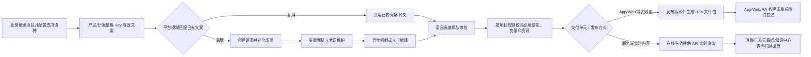
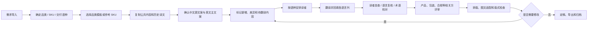

# 多语言管理平台需求反推文档

> 公司级整合版请参阅：[公司级多语言翻译平台需求文档](./公司级多语言翻译平台需求文档.md)。本文件保留为交互稿反推及历史补充底稿。

> 来源：`多语言管理平台交互_update20220325.pdf`
>
> 反推版本：v0.3
>
> 反推时间：2026-07-22
>
> 说明：本文基于交互稿反向整理，部分未在交互稿中明确的业务定义已标注为“待确认”。

## 1. 产品概述

多语言管理平台用于集中管理多个项目的多语言文案，支持项目维度的语言配置、文案新增和维护、文案批量导入、文案导出、审核流转、操作日志和项目权限管理。

平台核心目标：

- 让项目团队能够按项目管理键词和多语言翻译内容。
- 让编辑人员能够快速新增、修改、引用、筛选和导出文案。
- 让审核人员能够对创建、编辑、删除类变更进行审核。
- 让项目管理员能够管理项目成员、角色和权限。
- 通过相似文案、相关文案、异常字符检查、未引用检查等能力降低重复翻译和错误上线风险。

### 1.0 文档输出框架（后续整理基线）

后续将把整个多语言平台按“三层结构”持续整理，避免把已上线能力、现状痛点和未来规划混为一谈：

- **第一部分：现状**——包装说明书翻译与排版、外部供应商排版系统、UGNAS 后台既有多语言需求、AIoT 多语言一期和二期现状。
- **第二部分：规划及方案**——统一平台的定位与边界、共性数据模型、AIoT/UGNAS/包装的复用关系、外部系统对接策略和分期路线。
- **第三部分：具体需求**——项目管理、词条/句段、术语库、翻译任务、机器翻译、质量检查、评审、排版协同、发布版本、权限、通知和审计等功能需求。

当前文档已经完成第一部分的大部分现状反推，并在 1.4 节提前记录了包装场景的优化方向和一期 MVP；后续正式版本可将 1.4 及后续章节拆分为“规划及方案”和“具体需求”两部分。文中使用以下状态口径：`[已完成]`、`[规划中]`、`[既有需求基线]`、`[现状痛点]`、`[待规划]`。

### 1.1 包装部门场景补充

除交互稿中偏“文案库/项目文案管理”的能力外，包装部门存在说明书多语言翻译的标准化诉求。当前流程为：需求导入、说明书撰写、翻译、排版。现状痛点包括：

- 相同品类说明书结构高度相似，但当前无法复用结构模板。
- 同类产品存在大量公共词条和公共段落，但当前无法复用翻译结果。
- 小语种翻译质量不佳，且不同项目之间翻译口径不一致。
- 翻译后的文案与排版版式匹配效果不佳，容易出现文本溢出、换行不合理、语义断裂等问题。
- 项目相关方对说明书的评价、修改意见无法直接沉淀到说明书对应位置，沟通链路分散。

因此，平台需要从“多语言文案管理”扩展为“标准化翻译词库 + 说明书翻译工作流”：

- 建立品类说明书结构模板，复用章节、模块、注意事项、安装步骤等结构。
- 建立公共词条库、公共句段库和翻译记忆库，提升复用率。
- 建立小语种翻译质量检查和术语一致性校验机制。
- 支持翻译结果与排版预览联动，提前发现版式问题。
- 支持相关方在说明书内容或版式位置上直接评论、修改、确认。

### 1.2 基于现有模板与术语表的现状分析

本次补充分析的资料包括：充电器多语翻译模板、无线充翻译模板、移动电源多语翻译模板和多语术语表，共 4 个文件、46 个工作表。资料反映出的不是一个固定模板，而是一套按品类、SKU、公共物料、特殊款、历史版本和供应商协作拆分的素材库。

#### 1.2.1 当前资料的组织方式

- 充电器文件包含通用翻译模板、彩盒、插脚提示语、特殊款、台湾繁体、新增内容和修改记录。
- 无线充文件同时包含通用安全指南、温馨提示、功率分配、故障处理、多个 W 系列 SKU，以及供应商翻译页。
- 移动电源文件同时包含通用物料、通用标题、功率分配、故障显示、线充款、磁吸无线款、大功率屏幕款、历史旧版和修改记录。
- 同一文件中既有可复用公共内容，也有某个 SKU 的差异内容；当前主要通过“参考 PB522/PB724/PB760”等文字说明和复制粘贴完成继承。

由此判断，平台需要同时支持“公共模板”和“产品实例”两层对象：公共模板维护标准章节和公共内容，产品实例只维护差异项，不能继续把每个 SKU 复制成一份互相独立的 Excel。

#### 1.2.2 当前流程中已经存在的隐性规则

现有文件已经形成了一些工作规则，但这些规则依赖人工记忆和颜色识别：

- 中文和英文通常作为源文案，部分文件明确要求“以英文文案为准”。
- 已有译文会从相近 SKU 或旧版文件复制，译者再人工复核。
- 黄色、粉色底色通常表示需要翻译或排版的内容；红色字体/底色表示新增或修改内容；绿色文字在部分移动电源模板中表示复制来的译文需要复核；蓝色文字用于标识与参考 SKU 的差异点。
- 译者姓名直接写在语言列标题或备注中，例如“译者：Fiona”，并要求各语种译者署名，说明当前已经存在翻译任务指派需求，但尚未形成独立任务对象。
- 修改记录以 Excel 工作表维护，记录版本、修改说明、修改人、原因、章节和日期，但无法精确关联到句段、语种和版式位置。

这些颜色和备注不能直接作为平台状态。平台应将其转换成结构化字段，例如“待翻译、待复核、源文案变更、参考差异、待排版、已确认”，并记录状态变更人和时间。

#### 1.2.3 术语表的现状与问题

术语表采用“中文术语 + 多语言横向列”的矩阵结构。当前可识别的有效术语约 24 条，语言列包含英语、德语、法语、西班牙语、意大利语、俄语、日语、阿拉伯语、荷兰语、瑞典语、波兰语、土耳其语、巴葡、印度尼西亚语、韩语，以及捷克语、斯洛伐克语、希伯来语、保加利亚语、泰语、越南语等扩展语种。

从填写情况看：英语为 100% 填充；德语、法语、西班牙语、意大利语、俄语、日语、阿拉伯语、荷兰语、瑞典语、波兰语、土耳其语约 95.8%；巴葡约 91.7%；印度尼西亚语约 79.2%；韩语约 70.8%；捷克语、斯洛伐克语、希伯来语、保加利亚语、泰语、越南语约 29.2%。其中“德语更新”列仅少量填写，属于人工追加的版本修订列，不是可长期维护的术语版本机制。

术语表还存在以下结构性问题：

- 语种编码不统一：同一语种在不同文件中出现 JP/JA、KO/KR、ID/IND、SV/SE 等写法。
- 西班牙语未区分欧洲西语和拉美西语，葡萄牙语未明确 pt-BR 等地区变体。
- 同一中文标题存在多个英文或目标语表达，例如“产品展示”在不同模板中出现 Product Overview、Product Details；“故障显示及处理”出现 Troubleshooting、FAQ 等。
- 术语表缺少术语 ID、定义、适用品类、适用市场、上下文、审核状态、废弃状态、维护人和版本生效时间。
- 目前无法表达“同一中文词在不同语境允许不同译法”，也无法阻止已废弃译法继续被复制使用。

因此，平台不能只把术语表做成在线 Excel，而应建设带版本、语境和审核状态的术语库，并保留历史项目所使用的旧译文快照。

#### 1.2.4 模板和文件层面的技术风险

- 模板大量依赖合并单元格、长文本、多语言横向展开和颜色标记，缺少稳定的句段 ID，不利于差异比较、批量更新和任务拆分。
- 多个文件通过 `DISPIMG` 公式引用图片；部分备注直接依赖 `\\172.16...`、`\\filesvr...` 网络路径，换人、换环境或外部供应商协作时容易失效。
- 无线充和移动电源文件中存在使用范围扩展到 `XFD` 的工作表，说明部分格式被铺到了整行/整列，可能造成文件变大、渲染慢、打印区域异常等问题。
- 语言列并非固定集合，不同 SKU 的语言数量和顺序不一致，存在印尼语、韩语、泰语等后续追加现象；当前无法直接从文件判断某个项目的“应交付语种”。
- 公共内容、SKU 差异内容、历史旧版和供应商版本混在同一文件体系中，缺少“来源版本、继承关系、差异范围和生效范围”。

#### 1.2.5 对平台需求的直接推导

基于上述资料，平台至少需要补充以下能力：

1. 语种主数据：统一语言编码、展示名称、地区变体、默认顺序和项目可选范围。
2. 品类模板：维护章节、固定模块、可选模块、版式约束和模板版本。
3. 结构化句段：每个可翻译单元拥有稳定 ID，支持源文案、译文、上下文、图片/占位符和来源引用。
4. 模板继承与差异：新 SKU 可从同品类模板或参考 SKU 生成，并展示新增、删除、修改和继承内容。
5. 术语库与翻译记忆：按完全匹配、高相似匹配、品类、市场、语境和审核状态推荐复用。
6. 翻译任务：按语种、章节、句段或模块拆分，支持指派、领取、转派、退回、返工、截止时间、逾期和进度统计。
7. 颜色规则结构化：将黄/红/绿/蓝等视觉标记转为可查询状态，不再依赖人工识别颜色。
8. 多方评审：评论绑定到句段、语种、图片或版式区域，支持指派、回复、解决、重开和版本追踪。
9. 排版预览：支持按语种预览并检查溢出、换行、图片对应、字体覆盖和页数变化。
10. 资产与版本管理：图片、参考文件和外部路径进入平台资产库；每次修改记录到具体对象、语种、任务和版本。

#### 1.2.6 UGNAS 后台既有多语言需求现状

> 来源：`/Users/chenweixiong/Documents/ugnas admin/UGNAS后台需求梳理.md`。
>
> 本节用于记录 UGNAS 后台已经明确的多语言业务范围和既有需求，作为多语言系统的现状基线；其中部分内容属于后台需求设计，不代表外部翻译排版系统已经具备这些能力。

##### 1.2.6.1 多语言业务覆盖范围

UGNAS 后台的多语言能力不是单一的说明书翻译，而是服务于多个产品端和内容类型：

- App、后台、设备端、知识中心等多端文案。
- 软件、固件、应用、AI 模型、安装包同步等版本发布内容。
- 知识中心文章、应用指南、需求公示等面向用户的内容。
- 多语言词条、翻译任务、翻译审核和翻译结果同步。

已明确存在多语言字段的业务对象包括：

| 业务模块 | 多语言内容 / 字段 | 关联用途 |
| --- | --- | --- |
| 软件版本 | 多语言版本描述、补充描述 | 版本详情、发布和用户端展示 |
| 固件版本 | 多语言版本描述、补充描述 | 固件发布、升级说明和版本展示 |
| 应用管理 | 多语言应用名称、多语言应用描述、安装协议等 | App / Web / PC 端应用展示 |
| AI 模型 | 选择语言、多语言名称、多语言标签、模型描述 | 模型筛选、模型下载和用户端展示 |
| AI 模型下载 | 多语言标题、端侧模块配置 | 下载入口和模块展示 |
| 安装包同步 | 多语言版本描述、多语言补充信息 | 多站点同步和版本发布 |
| 知识中心 | 语言、国际化、翻译类型、批量翻译、机器翻译、预览 | 帮助中心、应用指南和设备端入口 |

##### 1.2.6.2 后台多语言词条模块

UGNAS 后台独立设置了“多语言词条管理”模块，包含以下页面：

| 页面 | 主要职责 | 已明确的操作 |
| --- | --- | --- |
| 词条查询 | 按词条和翻译状态查询内容 | 搜索、重置、批量备注、批量删除、批量废弃、批量驳回、批量导出、发起翻译、查看翻译状态、查看操作日志 |
| 翻译任务管理 | 查看并处理各语种翻译任务 | 按 Key、平台、模块、语言 Code、语言状态、译员等筛选；批量导入、批量导出、批量通过、不通过、开始翻译、开始审核 |
| 模块管理 | 管理词条所属的平台和业务模块 | 新增、修改、删除、查询模块，查看关联词条数 |

##### 1.2.6.3 词条、翻译任务和模块字段

后台需求中已经形成了相对明确的结构化对象：

| 对象 | 已明确字段 |
| --- | --- |
| 词条 | Key、中文、软件平台、模块、语境图、备注、加急、期望返稿时间、词条状态、翻译进度、创建人、创建时间、译文更新时间 |
| 翻译任务 | Key、语言 Code、中文、译文、模块、平台、语言状态、译员、审核人、审核意见、备注人、译文更新时间、期望返稿时间、词条创建时间 |
| 模块 | 平台、模块名称、模块编码、关联词条数、创建者、创建时间、更新者、更新时间 |
| 导入数据 | Key、中文、语言 Code、译文、模块、平台、客户端、备注 |

其中，`Key`、语言 Code、平台和模块是后续与包装说明书句段模型对接时需要重点复用的字段思想；但包装场景还需要增加品类、SKU、市场、章节、句段 ID、图片/占位符和版式位置等属性。

##### 1.2.6.4 后台已定义的状态和流程

后台需求中已经定义了词条级和语言级状态：

- 词条状态：已创建、待翻译、翻译中、待审核、审核通过、审核驳回、已发布、废弃。
- 语言状态：待翻译、待审核、通过、不通过。
- 典型流程：新增或导入词条 → 选择平台和模块 → 填写中文、Key 和语境图 → 发起翻译 → 按语言生成任务 → 译员翻译 → 提交审核 → 审核通过或驳回 → 导出 / 同步到业务系统。
- 机器翻译只能作为辅助初稿，已锁定的人工译文不能被批量机器翻译覆盖。
- 翻译员不应审核自己的译文，具体角色互斥规则仍需确认。
- 驳回、废弃、删除、批量处理和同步操作需要记录操作日志。

##### 1.2.6.5 既有权限和协作要求

后台需求已经体现出以下角色和治理要求：

- 多语言管理员负责词条新增、批量导入、批量删除、批量废弃和同步管理。
- 翻译员负责目标语种翻译，审核员负责译文审核。
- 翻译任务需要记录译员、审核员、期望返稿时间、备注、审核意见和操作日志。
- 删除、废弃、批量导入、批量导出和批量同步等高影响操作应支持权限控制、二次确认或审批配置。
- 词条和翻译结果需要支持批量导入导出，并提供失败明细和操作记录。

##### 1.2.6.6 与包装说明书场景的关系

UGNAS 后台需求可作为多语言平台的“通用词条翻译底座”，但不能直接覆盖包装说明书的完整需求：

| 能力 | UGNAS 后台需求现状 | 包装场景需要补充 |
| --- | --- | --- |
| 词条管理 | 已有 Key、平台、模块、语言 Code 和状态 | 增加品类、SKU、章节、句段、图片和版式位置 |
| 翻译任务 | 已有按语言拆分、译员、审核员、期望返稿时间 | 增加章节/句段级任务、供应商、排版负责人、返工和逾期催办 |
| 内容复用 | 以 Key、模块和平台组织复用 | 增加品类模板、参考 SKU、公共句段和翻译记忆 |
| 翻译审核 | 已有通过、不通过、驳回和审核意见 | 增加上下文评审、术语命中、数字/单位检查和版本对比 |
| 发布同步 | 已有导出和同步到业务系统 | 增加说明书定稿包、排版文件、PDF/菲林文件和交付批次 |
| 质量追踪 | 有状态和操作日志要求 | 增加小语种质量指标、返工率、漏译率和排版问题统计 |

因此，后续平台设计应采用“通用多语言词条能力 + 包装说明书扩展对象”的方式：复用 UGNAS 后台的 Key、平台、模块、语言 Code、译员、审核员、状态和日志模型，同时新增品类模板、SKU 继承、句段、排版和供应商协作模型。

#### 1.2.7 AIoT 多语言管理功能现状

> 来源：`/Users/chenweixiong/Downloads/多语言管理功能 · 一期.docx`、`/Users/chenweixiong/Downloads/多语言管理功能 · 二期（导入智联App本地文案 及App本地文案在线更新能力）.docx`。
>
> 状态口径：一期已完成；二期规划中，预计 2026 年 8 月底完成。二期中的 App 原生/RN 文案在线更新属于后续 P1，当前不作为本次 8 月交付范围。
>
> 本节描述的是 AIoT 产研多语言能力的现状基线。它主要服务 App、RN、H5、Web、服务端和云端配置，不等同于包装说明书翻译流程，也不代表统一多语言平台已经完成整合。

##### 1.2.7.1 业务定位与服务对象

AIoT 多语言能力解决的是产品研发和运行时文案管理问题，核心诉求是把原先写死在代码、静态配置文件或 Excel 中的多语言内容，统一沉淀为可被前后端调用的多语言服务：

- **服务对象**：App 原生页面、RN 页面、Web/H5、IoT 平台后台、消息推送、产品元数据、知识中心和其他云端配置业务。
- **主要痛点**：文案写死在代码中，修改必须发版；前后端语言配置不统一；翻译和审核依赖 Excel 与人工；前端缺少版本追溯；新增语种需要大量人工改文案；云端实时渲染场景无法查询和在线修改。
- **平台定位**：为前端项目和后端项目提供统一的项目管理、Key/词条、语言主数据、翻译、审核、版本和 API 能力。
- **与包装场景的差异**：AIoT 以运行时文本/资源和软件发布为中心，包装场景以品类模板、SKU、说明书章节、句段、排版和交付文件为中心；两者可复用语言、术语、任务、审核和版本等底座，但业务对象和生效方式不同。

##### 1.2.7.2 一期已完成能力基线

按当前项目状态，AIoT 一期已完成的能力可归纳为以下基线：

1. **统一多语言服务**：为前端和服务端提供统一管理后台及对外接口，业务系统不再各自维护语言文件和语言 Code。
2. **项目管理**：项目具有全局唯一的项目 ID，并区分前端项目和后端项目；项目按自身需要配置支持语种，而不是所有项目统一新增语种。
3. **Key 与词条 ID**：多语言 Key 在项目内唯一；平台生成全数据中心唯一的词条 ID，词条可独立修改并记录版本，不直接依赖数据库主键。
4. **前端/后端生效机制**：前端项目支持版本管理，提测可拉取最新版本，集成包拉取最新且已发布版本；后端项目无独立版本，文案修改后可即时生效。
5. **词条维护**：支持单条编辑、批量新增、批量更新、批量导出，以及导出按语种拆分的 JSON/i18n 压缩包。
6. **任务管理**：支持批量导出、批量机翻和批量更新任务，记录处理状态、异常信息和结果文件。
7. **统一多语言配置组件**：Web 表单通过 `🌐` 打开语种配置抽屉，维护场景说明、场景图片和各语言文案；组件根据项目支持语种动态渲染语言项。
8. **机器翻译与术语保护**：以简体中文为源文案发起单条或批量机翻，仅回填空白目标语种，不覆盖已有人工译文；支持词典/术语配置，保护专有名词、代码、缩写和非译词。
9. **语言主数据**：维护语言名称、语言 Code、机翻 Code 和面向用户的显示名称，解决各端语言编码不一致问题。
10. **对外接口**：提供下载项目最新版本、下载项目最新已发布版本、批量创建词条 ID、按项目和语种批量查询文案、查询项目支持语言列表、按项目查询 Key 列表等接口。
11. **通知与审计基础**：异步任务完成或异常后支持任务结果下载，并规划通过钉钉机器人通知；项目、词条和任务操作需要保留可追溯记录。
12. **占位符规范**：已形成 iOS/Android 占位符、数字、百分号、引号、HTML 转义、换行和制表符等基础约定，为二期变量保护提供输入规范。

##### 1.2.7.3 二期规划与当前进度

二期的主线是将绿联智联 App 的存量本地文案和 Key 纳入平台，并接入 App CICD；同时补齐一期在必填语言、变量和多媒体资源上的能力缺口。

**评审已确定的范围与里程碑**：

- 本期先统一智联 App 内 Android、iOS 的 Key 和文案。由于两端当前 Key 不一致，产品负责统一 Key，研发负责导出现有文案，平台负责脚本导入。
- App 项目建议按“App 原生页面、不同品类 RN 页面、公共词条”划分，最终由 App 产品和研发确认。
- 评审要求 2026 年 7 月 31 日输出统一后的 Key 和文案表格；二期整体预计 2026 年 8 月底完成。
- App 原生页面、RN 页面在线更新在评审中列为后续独立支持项，当前二期不包含在线更新闭环。

**二期 P0 能力（规划中）**：

- **必填语言**：项目必填语言只能是支持语言的子集；简体中文始终必填，不需要重复配置。必填语言规则覆盖多语言组件、词条编辑、API 写入、导入、机翻和发布。历史词条不自动补齐，但在编辑、批量更新和发布时按最新规则校验；发布前扫描本版本，任一必填语言缺失则阻断发布，并提供缺失 Key、语种和资源类型统计及导出。
- **App 项目导入**：支持创建智联 App 项目、导入 Android/iOS 存量文案、校验导入结果、生成项目发布包，并支持前端单独新增 Key。
- **CICD 集成**：App 构建时通过 API 拉取项目最新已发布的 i18n 文件包，作为提测和集成测试打包输入。
- **多媒体资源**：Key 增加资源类型，支持文本、图片、视频和富文本。图片、视频按语种上传或维护 URL，不进入机翻；富文本按 HTML 文案处理。资源类型创建后不可修改，并记录上传人、上传时间、URL 和历史版本。
- **变量管理**：新增变量模板管理，默认覆盖 `%1$@`、`%1$d`、`%1$f`、`%%`、`\n`、`\t`，并支持 `{name}`、`{{name}}`、`%s`、`%d` 等 App/RN 写法。机翻前将变量替换为统一占位符，机翻后校验变量完整性并还原；单个 Key 最多 9 个变量，疑似变量未配置或变量异常时阻断该语种机翻。
- **输入限制**：简体中文默认文案最多 1000 字符，目标语种译文最多 10000 字符。
- **英文兜底**：增加项目默认语言定义，解决海外项目在多语言服务异常时没有英文文案可兜底的问题。

**二期 P1 / 后续能力**：

- App 端静默检查新语言包、后台下载和解压，重启后加载新包并删除旧包。
- App 原生页面、RN 页面文案在线更新，避免普通文案修改也必须等待 App 或插件发版。

##### 1.2.7.4 AIoT 多语言对象与数据模型

一期和二期已体现出一套相对稳定的产研多语言对象模型：

| 对象 | 当前定义 / 关键字段 | 状态与版本特征 |
| --- | --- | --- |
| 项目 | 项目名称、项目 ID、归属业务线/组织、交付单元、内容形态、默认语言、必填语言 | 发布方式由交付单元决定；业务线只负责权限和组织归属 |
| 多语言 Key | 项目内唯一，代表文本或文件型多语言内容 | 新增 Key 不支持删除；资源类型创建后不可更改 |
| 词条 ID | 平台生成、全数据中心唯一，用于同步和独立版本追踪 | 可单条修改并记录版本快照 |
| 语言主数据 | 语言名称、locale/语言 Code、机翻 Code、用户显示名称 | 统一各端语言编码，按项目选择语种 |
| 翻译内容 | 简体中文源文案、各目标语言译文、场景说明、场景图片、备注 | 语言级可编辑、审核和回填，已有人工译文不被机翻覆盖 |
| 资源类型 | 文本、图片、视频、富文本 | 图片/视频只保存按语种的文件 URL；富文本支持 HTML 机翻 |
| 变量模板 | 变量名称、类型、匹配规则、示例、业务说明、启用状态 | 停用后不影响历史译文和历史机翻记录 |
| 任务 | 批量导出、批量机翻、批量更新等任务，含任务 ID、状态、结果和异常原因 | 异步执行，完成/异常后提供结果文件 |

**项目边界调整建议（公司级平台统一模型）**：一个项目只对应一个交付单元。App、Web、服务端分别建立项目；说明书与包材也分别建立项目。多个载体如果属于同一需求批次，可通过可选的“关联项目组”汇总查看，但不合并项目的内容、任务、状态、负责人、权限或发布流程。语言资产、内容空间和源版本可以被多个项目引用，并在项目内形成版本快照。

##### 1.2.7.5 AIoT 多语言流程

一期已形成的基础流程与二期 App 导入/CICD 流程可以归纳如下：

二期智联 App 的实际导入链路为：研发导出现有 Android/iOS 文案 → 产品统一 Key、确认冲突文案是否复用 → 平台脚本批量导入 → 导入结果校验 → 生成项目 i18n 包 → 接入 App CICD。在线更新能力不进入当前导入链路，待后续 P1 单独落地。

##### 1.2.7.6 AIoT 与其他多语言场景的边界

| 场景 | 服务对象 | 核心对象 | 生效方式 | 当前状态 |
| --- | --- | --- | --- | --- |
| 产研类交付 | App、RN、H5、Web、服务端、云端配置；各载体分别建项目 | 项目、单一交付单元、Key、词条 ID、语言、变量、资源、版本 | 资源型载体发布版本；服务端可即时生效 | 一期已完成；二期规划中 |
| 既有后台/业务内容接入 | App、后台、设备端、知识中心、版本内容 | Key、交付单元、可配置标签、语言任务、审核状态 | 翻译审核后导出或同步业务系统 | 既有需求基线 |
| 包装说明书多语言 | 包装、说明书、彩盒、菲林及供应商交付物 | 品类模板、SKU、章节、句段、术语、排版版本 | 项目定稿后形成排版/交付包 | 现状痛点与待规划 |

三类场景可以共用的底座包括语言主数据、术语库、翻译记忆、任务指派、机器翻译保护、审核状态、版本快照、权限和操作日志；暂不能直接共用的部分包括：

- 资源型交付的项目/Key/API/版本包，与包装的品类/SKU/章节/句段/排版文件不是同一内容形态，因此分别建项目更利于流程和权限隔离。
- AIoT 的前端发布和后端即时生效，与包装的定稿、印刷批次和菲林交付不是同一种发布机制。
- AIoT 资源多语言以图片/视频 URL 和运行时返回为主，包装还需要版式、字体、页数、溢出和印前检查。
- 既有接入系统的平台、模块、客户端等字段作为可配置标签或来源元数据保留；包装仍需增加模板继承、差异对比、供应商和排版协同对象。

### 1.3 当前说明书翻译流程反推

根据业务描述、模板中的操作说明、参考 SKU 备注、译者署名和修改记录，可以反推出当前实际流程如下。该流程属于对现有资料的业务还原，不代表已有正式系统流程。

#### 1.3.1 需求导入与交付范围确认

- 根据产品品类和 SKU 判断使用充电器、无线充或移动电源模板。
- 根据目标市场和渠道确定说明书、彩盒、插脚提示语、功率分配、故障处理等交付物。
- 通过人工配置语言列确定目标语种。现有文件中语言集合并不统一，部分语种是后续追加的。

#### 1.3.2 选择模板与参考内容

- 优先选择同品类模板或相近 SKU 作为基准。
- 通过“参考 PB522”“参考 PB724”“参考 PB760”等备注寻找可复用内容。
- 部分内容通过共享盘或网络路径定位历史文件，再人工复制到当前模板。

这一步实际上承担了“模板继承、公共段落复用和翻译记忆匹配”三种工作，但当前没有系统化的继承关系和引用关系。

#### 1.3.3 中文与英文主文案确认

- 先确认中文内容和英文主文案。
- 部分模板明确要求各语种翻译和更新以英文列为准。
- 产品名称、参数、功率、接口名称、安全警示等内容通常先由文案/产品侧确认，再进入多语言处理。

#### 1.3.4 差异识别与翻译范围标记

- 通过黄色、粉色底色标记需要翻译或排版的内容。
- 通过红色文字或红色底色标记新增、修改或需要补译的内容。
- 通过蓝色标记与参考 SKU 的差异点。
- 部分移动电源模板使用绿色文字标识已复制但需要复核的译文。

因此，当前“翻译范围”不是系统自动计算，而是由模板维护人用颜色手工标注。

#### 1.3.5 翻译任务安排

- 通过语言列标题中的译者姓名、备注或线下沟通安排译者。
- 译者进入自己负责的语种列，补充空白内容，或复核从参考 SKU 复制来的内容。
- 当前没有独立的任务编号、任务状态、截止时间、进度、转派、退回和逾期提醒。

这说明翻译任务指派已经存在业务需求，但目前只是“人名 + 语言列 + 备注”的弱指派模式。

#### 1.3.6 翻译、复核与质量确认

- 译者补充目标语种译文。
- 对复制来的旧译文进行校对，发现问题后直接修改并用颜色标记。
- 对阿拉伯语等存在特殊语序或版式要求的语种，额外维护语序截图或图示。
- 产品、文案、安规/合规人员可能通过修改记录、备注或线下沟通提出修改意见。

当前质量确认主要依赖人工经验，系统未提供术语一致性、漏译、数字/单位、占位符、禁用词和小语种规则检查。

#### 1.3.7 排版与设计协同

- 翻译模板同时承担译文表和设计排版参考，包含产品示意图、连接示意图、故障图标和版式提示。
- 设计人员根据各语言文本长度、图片和模块结构进行排版。
- 当出现文本过长、换行不合理、图文不匹配或语言缺失时，返回模板修改。

因此，当前翻译与排版并非完全割裂，而是通过同一份宽表和颜色标记进行交叉协作，但没有真正的排版预览和风险反馈闭环。

#### 1.3.8 修改、定稿与归档

- 修改通过颜色、备注和“修改记录表”记录。
- 修改记录通常记录版本、修改说明、修改人、修改原因、章节和日期。
- 定稿后通过 Excel、设计文件或共享盘路径继续流转和归档。
- 历史译文和参考文件保留在不同文件或共享盘中，后续项目再人工查找和复制。

#### 1.3.9 当前流程的核心断点

| 流程环节 | 当前做法 | 平台化后的目标 |
| --- | --- | --- |
| 模板选择 | 人工找相近 SKU | 按品类、产品能力和市场推荐模板 |
| 内容复用 | 复制粘贴、共享盘查找 | 术语库、公共句段库、翻译记忆自动匹配 |
| 差异识别 | 黄色/红色/蓝色标记 | 系统生成新增、修改、继承差异 |
| 任务指派 | 语言列写译者姓名 | 独立任务、负责人、截止时间、进度和提醒 |
| 翻译复核 | 译者手工修改并标色 | 句段级审核、评论、退回和返工 |
| 质量控制 | 依赖人工经验 | 术语、数字、漏译、格式和小语种规则校验 |
| 排版协同 | Excel 中看图和长文本 | 按语种排版预览和溢出预警 |
| 版本归档 | 修改记录表和共享盘 | 对象级版本、来源、影响范围和可追溯审计 |

### 1.4 流程优化方案与产品需求

#### 1.4.1 优化目标

优化的重点不是把 Excel 原样搬到网页，而是把当前依赖个人经验的规则转成系统能力：

- 一个项目只有一个受控的源文案版本。
- 同品类内容优先复用，差异内容才进入翻译任务。
- 每个翻译内容都有明确的语种、负责人、状态和截止时间。
- 术语、数字、参数、占位符和排版风险在提交前自动检查。
- 评论、审核、返工和定稿都绑定到具体句段和版本。
- 旧版本、参考 SKU 和复用来源可追溯，公共内容变更可提示影响范围。

#### 1.4.2 建议的目标流程

| 阶段 | 当前问题 | 优化方案 | 需求优先级 |
| --- | --- | --- | --- |
| 项目创建 | 语种和交付物写在模板里，容易遗漏 | 项目表单统一维护品类、SKU、市场、交付物、语种和截止时间 | P0 |
| 模板选择 | 人工寻找相近 SKU | 按品类和产品能力推荐模板，支持模板继承和版本 | P0 |
| 内容准备 | 公共内容被复制成多份，源文案与译文混在同一宽表 | 增加源内容工作区，独立管理源文案/源 Key、上下文、来源和源版本；冻结后再生成翻译任务 | P0 |
| 预翻译 | 人工复制历史译文 | 术语库、公共句段库、翻译记忆自动匹配 | P0 |
| 任务安排 | 译者姓名写在语言列 | 自动生成翻译任务，支持指派、转派、退回、逾期和进度 | P0 |
| 翻译处理 | 译者在宽表中找空白单元格 | 按语种和任务展示待处理句段，支持上下文和参考译文 | P0 |
| 质量检查 | 依赖人工经验 | 术语、漏译、数字/单位、占位符、禁用词和格式检查 | P0 |
| 评审协同 | 意见分散在备注、颜色和线下沟通 | 句段级评论、指派、回复、解决和返工 | P0 |
| 排版联动 | 翻译后才发现版式问题 | 先支持结构化导出和排版问题回传，再建设按语种预览 | P1 |
| 定稿归档 | 修改记录和共享盘分散 | 版本、来源、审批人、发布时间和交付包统一归档 | P0 |
| 供应商协作 | 通过共享盘或独立文件协作 | 一期支持任务包导入导出，二期再支持供应商账号在线处理 | P1 |
| 成本管理 | 当前资料没有报价和结算信息 | 暂不纳入一期，后续按业务需要扩展 | P2 |

#### 1.4.3 一期（MVP）必须具备的需求

1. **项目与语种配置**：创建说明书项目，配置品类、SKU、市场、交付物、目标语种、负责人和截止时间。
2. **模板与模块复用**：按品类维护模板，模板由固定章节、可选模块和版式说明组成；新项目支持从模板或参考 SKU 创建。
3. **结构化句段**：每个句段拥有稳定 ID，保存源文案、语种译文、上下文、图片、占位符、来源和版本。
4. **术语库和翻译记忆**：完全匹配且已审核的内容可自动填充；相似内容只推荐不自动覆盖。
5. **翻译任务指派**：支持按语种、章节、句段或模块生成任务，记录主负责人、协作人、截止时间、优先级、状态和进度。
6. **翻译工作台**：展示源文案、参考译文、术语提示、上下文、历史版本和待处理问题，支持批量提交。
7. **质量门禁**：提交前检查漏译、数字、单位、型号、占位符、术语、标点和禁用词；阻塞问题未处理不可提交。
8. **评审与返工**：产品、文案、语言审核、合规和排版人员可对句段发表评论并指派处理人，支持通过、驳回、返工和重新打开。
9. **源内容管理**：支持源文案/源 Key 的导入、编辑、同步、差异对比、确认和冻结；源内容变更自动识别受影响的翻译、复核和排版范围。
10. **版本与审计**：区分源内容版本、工作版本和交付版本，记录每次修改前后内容、修改人、修改原因、来源版本、审核结果和生效范围。
11. **结构化导入导出**：支持 Excel 导入导出，保留句段 ID、语言编码、状态和任务信息，避免再次依赖颜色识别。

#### 1.4.4 一期验收标准

- 新建项目后，可从品类模板生成说明书章节和句段。
- 同品类已有公共内容能够自动推荐，完全匹配内容能够一键复用。
- 系统能自动生成各语种翻译任务，并显示负责人、截止时间、完成率和逾期状态。
- 译者能够只查看自己负责的语种和句段，不需要在超宽 Excel 中查找空白单元格。
- 提交前能够发现至少漏译、数字/单位不一致、术语不一致和占位符缺失四类问题。
- 评审意见能够定位到具体句段和版本，驳回后自动形成返工范围。
- 每次公共内容修改能够列出受影响的项目、SKU、语种和历史版本。
- 导入导出后句段 ID、语种和状态不丢失。

#### 1.4.5 建议的默认业务规则

以下规则可作为一期默认值，后续再根据访谈调整：

- 中文和已确认英文作为翻译源文案；若英文发生变更，相关译文自动标记为“待复核”。
- 项目负责人或包装负责人创建项目，系统在语种确认后自动生成翻译任务。
- 完全匹配且已审核的术语/翻译记忆自动填充；相似匹配必须人工确认。
- 默认先支持当前常用语种集合，语言主数据使用标准 locale 编码；印尼语、韩语等作为可选语种，不在模板中固定写死。
- 一期供应商通过任务包导入导出协作；在线供应商账号、报价和结算放到后续阶段。
- 一期通知先使用站内消息，确认公司协作工具后再接入飞书、钉钉或邮件。
- 公共术语变更只影响新项目；历史定稿保持快照，并向项目负责人提示影响范围。

### 1.5 A.13 待确认问题的可解决范围

A.13 中的问题可以分为“现有资料已经能确认”“可以先按产品规则解决”“必须通过业务/技术访谈确认”三类。

| A.13 问题 | 当前判断 | 处理建议 |
| --- | --- | --- |
| 1. 源文件格式 | 部分可确认：当前资料主要是 Excel，但最终排版源文件未知 | 先按 Excel 结构化导入导出设计；排版工具需补充访谈 |
| 2. 是否已有品类模板 | 可以确认“已有雏形”：充电器、无线充、移动电源均有品类和 SKU 模板 | 一期整理现有模板并建立版本，不必等待新模板从零制定 |
| 3. 是否已有公共词条 | 可以确认：已有《多语术语表.xlsx》 | 先导入术语库，再补充 ID、语境、审核和版本字段 |
| 4. 翻译来源 | 可以部分确认：存在内部译者署名，也存在翻译公司工作表 | 一期支持内部成员和任务包供应商两种模式 |
| 5. 优先治理语种 | 可以确认当前常用语种集合，但无法仅凭文件判断质量最差语种 | 先统计历史驳回、返工和投诉，再确定质量专项优先级 |
| 6. 排版软件与交付格式 | 当前资料无法确认 | 必须访谈设计/排版团队；一期先做结构化导出和问题回传 |
| 7. 评价意见渠道 | 可以确认意见目前分散在备注、颜色、修改记录和共享文件中，但具体协作工具未知 | 先在平台内建立评论闭环，再决定是否接入飞书/钉钉/邮件 |
| 8. 定稿必需角色 | 可建立初始角色：产品、文案、翻译、语言审核、合规、排版、项目负责人 | 各品类是否必须全员确认，需要项目试点确认 |
| 9. 定稿后是否自动复用 | 当前已有复制复用习惯，但是否自动进入公共库未知 | 默认“已审核定稿后可推荐复用”，自动发布公共词条需人工确认 |
| 10. 词条变更影响提醒 | 当前未见系统能力，但需求明确且可实现 | 建立引用关系，变更时提示受影响项目和 SKU |
| 11. 谁创建任务 | 当前资料未明确 | 一期默认项目负责人/包装负责人创建，系统自动生成语种任务 |
| 12. 默认译员/供应商 | 文件中有部分译者姓名，但不是完整映射 | 允许配置“语种-默认负责人/供应商”，缺省时手动指派 |
| 13. 供应商是否登录 | 存在供应商翻译页，但无法判断是否需要账号 | 一期任务包导入导出，二期再评估供应商账号 |
| 14. 工时、成本、结算 | 现有资料没有相关字段 | 不纳入一期，除非管理层明确要求 |
| 15. 通知渠道和催办 | 现有资料没有相关字段 | 一期站内通知和逾期列表；外部消息渠道后续接入 |

结论是：A.13 中至少有 8 项可以直接转为一期产品规则或 MVP 能力，4 项可以通过现有资料先建立初版，3 项需要排版团队、供应商或管理者访谈后再定。无需等所有问题确认后才开始，建议先以一个充电产品 SKU 做试点。

## 2. 角色与权限

### 2.1 角色类型

交互稿中出现的角色包括：

- 企业管理员：具备项目内所有权限。
- 授权管理员：具备权限管理、项目管理相关权限。
- 操作人员：具备具体业务操作权限，权限说明待产品定义。
- 运营管理员：具备运营相关操作权限，权限说明待产品定义。
- 项目管理员、系统管理员、审核专员、编辑者、查看者：出现在角色权限矩阵中，具体权限项待产品定义。

### 2.2 权限控制原则

- 用户只能看到自己有权限访问的功能、项目和内容。
- 用户无某功能权限时，对应入口、按钮、内容均隐藏。
- 用户无某项目权限时，对应项目卡片和项目详情不可见。
- 用户登录后若所有功能权限均为空，首页展示固定无权限空态：“暂无相关功能使用权限”。
- 审核权限需支持语种维度控制；审核列表仅展示用户有审核权限的语种。

## 3. 信息架构

平台包含以下一级区域：

- 首页
  - 项目卡片列表
  - 新增项目
  - 编辑项目
  - 文案导出
- 项目详情
  - 项目概况
  - 源内容
    - 源文案/源 Key 列表
    - 内容空间同步
    - 源版本与差异
    - 源内容冻结
  - 文案库
    - 文案列表
    - 新增文案
    - 编辑文案
    - 查看文案侧边栏
    - 删除文案
    - 批量导入
    - 文案导出
  - 审核
    - 创建/编辑审核
    - 删除审核
  - 日志
  - 权限
    - 成员管理
    - 角色管理

## 4. 通用要求

### 4.1 顶部信息

- 页面顶部展示平台名称、当前语言、当前登录用户。
- 当前语言支持简体中文和 English 切换；切换范围和多语言资源来源待确认。

### 4.2 分页

- 普通列表默认每页 10 条。
- 批量导入详情列表默认每页 20 条。
- 分页需展示当前页、可跳转页码、每页条数、前往页和总条数。

### 4.3 搜索

- 文案库、审核、权限成员等列表需支持关键字搜索。
- 文案库搜索支持键或文案内容模糊搜索。
- 审核搜索支持关键词搜索表格内容。

### 4.4 弹窗与二次确认

- 删除、批量通过、批量驳回等高风险操作需二次确认。
- 二次确认需说明操作影响，例如“删除后可能影响引用页面显示，请谨慎操作”。
- 审核通过或驳回后结果不可撤回。

## 5. 首页需求

### 5.1 项目卡片列表

首页以卡片形式展示用户有权限访问的项目。

项目卡片展示字段：

| 字段 | 说明 |
| --- | --- |
| 项目名称 | 展示项目名称 |
| 已翻译 | 该项目全部语言都已翻译的键词数占总键词数的比例 |
| 未翻译 | 该项目任一语言未翻译的键词数 |
| 累计键词数 | 该项目键词总量 |
| 项目语种 | 该项目支持配置的语种，最多显示 2 行，超出显示省略 |
| 查看详情 | 点击进入项目详情-项目概况 |
| 编辑入口 | 点击呼出编辑项目弹窗 |

排序规则：

- 项目卡片按项目新增时间倒序排列。

交互规则：

- 点击“查看详情”进入项目详情页。
- 点击项目编辑入口打开编辑项目弹窗。
- 无权限项目不展示。

### 5.2 新增项目

入口：

- 点击首页“新增项目”按钮，打开新增项目弹窗。

表单字段：

| 字段 | 必填 | 规则 |
| --- | --- | --- |
| 项目名称 | 是 | 点击输入框获取焦点，输入项目名称 |
| 项目语种 | 是 | 语种复选框，至少勾选 1 个，默认不勾选 |
| 备注 | 否 | 最多 50 字 |

按钮规则：

- 表单未按规则填写完成时，“确定”置灰不可点击。
- 表单填写完成后，“确定”高亮可点击。
- 点击“确定”后关闭弹窗并生成项目卡片。
- 点击“取消”关闭弹窗，不保存数据。

### 5.3 编辑项目

入口：

- 点击项目卡片编辑入口，打开编辑项目弹窗。

表单规则：

- 支持编辑项目名称、项目语种和备注。
- 若编辑时取消已配置语种：
  - 前端页面不再展示该语种信息。
  - 用户无法新增或编辑该语种文案。
  - 该语种历史数据仍保留，不删除。

### 5.4 首页文案导出

入口：

- 点击首页“文案导出”打开导出弹窗。

导出配置：

| 配置项 | 规则 |
| --- | --- |
| 选择要导出项目 | 必选，默认不勾选 |
| 选择要导出语言 | 必选，默认不勾选 |
| 选择要导出格式 | 支持 Excel、XML、JSON |
| 选择替换格式 | 具体选项交互稿未明确，待确认 |
| 选择指定内容 | 支持按标签指定内容 |
| 选择导出内容状态 | 支持待审核、已上线 |

按钮规则：

- 未勾选项目或语言时，“导出”置灰不可点击。
- 具体可导出字段以产品定义为准。
- 导出内容为最新记录文案。
- 状态说明支持鼠标 hover 展示 tips。

待确认：

- “选择替换格式”的业务含义和选项。
- 导出字段范围和格式样例。
- 是否支持跨项目批量导出同名 key 的合并或去重。

## 6. 项目详情-项目概况

### 6.1 概览模块

项目概况页展示项目整体翻译进度、各语种翻译进度和字符检查统计。

### 6.2 全部文案概览

展示字段：

| 字段 | 说明 |
| --- | --- |
| 累计键词数 | 项目的键词总量 |
| 已翻译 | 全部语言都已翻译的键词数占总键词数的比例 |
| 未翻译 | 任一语言未翻译的键词数 |

交互规则：

- 点击统计数据区域，进入文案库页并自动带入对应筛选条件。
- 点击“未翻译”时，筛选“全部语言 - 未翻译”。

### 6.3 语种概览

展示规则：

- 根据项目配置的语种动态展示语种卡片。
- 每个语种展示该语种已翻译比例和未翻译数量。

字段定义：

| 字段 | 说明 |
| --- | --- |
| 已翻译 | 有该语种文案的键词数占总键词数的比例 |
| 未翻译 | 没有该语种文案的键词数 |

交互规则：

- 点击语种统计数据，进入文案库并筛选当前语种的翻译状态。
- 例如点击俄文未翻译，进入文案库并筛选“俄文 - 未翻译”。

### 6.4 字符检查

展示固定检查维度：

- 标记待处理数。
- 检查存在异常数。
- 检查存在未引用数。

交互规则：

- 点击统计项进入文案库，并按对应标签或状态筛选。
- 排序规则：按数量从大到小排序；数量相同时按标签 ID 排序。

待确认：

- 字符检查维度是否允许用户自定义。
- “存在异常”的具体校验规则。
- “待处理”是标签、文案状态还是人工标记。

## 7. 项目详情-文案库

### 7.1 文案列表

文案库列表展示项目下所有键词及各语种文案。

列表字段：

| 字段 | 说明 |
| --- | --- |
| 键 | 文案 key |
| 各语种文案 | 根据项目配置语种动态展示，例如简体中文、英文、韩文、俄文、台湾正体、港澳繁体 |
| 上线状态 | 已上线、待审核 |
| 更新时间 | 最近更新时间 |
| 操作 | 查看、编辑、删除 |

列表交互：

- 支持拖拽表头分割线调整字段显示宽度。
- 鼠标移入内容字段时展示完整文本浮层，浮层最长不超过屏幕宽度的四分之一。
- 鼠标移出后浮层消失。
- 点击内容字段可复制内容，并显示“复制成功”toast。
- 点击键值可呼出该键查看侧边栏。

### 7.2 文案筛选

文案库支持以下筛选：

| 筛选项 | 规则 |
| --- | --- |
| 语言翻译状态 | 支持语言筛选及翻译状态筛选 |
| 上线状态 | 全部、已上线、待审核 |
| 标签 | 全部、无标签、已配置标签 |
| 文案状态 | 全部、有异常的键、无异常的键 |
| 引用状态 | 全部、已被引用、未被引用 |
| 更新时间 | 支持开始日期和结束日期 |
| 搜索 | 支持键或文案内容模糊搜索 |

语言翻译状态规则：

- “全部语言”可选择“全部翻译状态”。
- 单语种筛选不展示“全部翻译状态”选项。
- 可选语种基于项目配置的语种动态展示。

标签筛选规则：

- 固定选项包含“全部”和“无标签”。
- 其余筛选项来自已配置标签。

### 7.3 新增文案

入口：

- 点击文案库“新增文案”进入新增文案页。

页面标签：

- 文案配置。
- 文案信息。
- 相关文案。
- 历史。

文案配置字段：

| 字段 | 规则 |
| --- | --- |
| 键 | 支持添加键；添加前需查重，重复时报错“已有该键值” |
| 各语种文案 | 根据项目配置语种动态展示输入框 |
| 引用其他键词 | 可从其他项目库引用已有文案 |

保存规则：

- 至少填写一个语种文案，否则“保存”置灰不可点击。
- 异常文本校验不阻塞保存。

键字段规则：

- 点击“添加”显示键输入框。
- 输入 key 后回车确认。
- 新增 key 需查重校验，重复不可添加。
- key 添加后不可删除、不可修改。
- 若引用了其他键词，被引用键值直接添加到该字段。

### 7.4 文案信息

文案信息包含：

- 描述。
- 上下文。
- 图示。
- 标签。
- 涉及的功能/业务。

上下文规则：

- 可添加描述和图片。
- 图片支持 png、jpg、jpeg。
- 单个文件不超过 5M。
- 输入内容后支持实时检索相似或相同内容。
- 有匹配内容时直接呼出浮窗。
- 输入框失焦时浮窗消失，重新获焦时再次显示。
- 上下文列表按添加时间倒序显示。
- 点击“应用”后绑定到当前文案，按钮变为“取消应用”。
- 点击“取消应用”解除绑定。
- 应用或取消应用不会关闭弹窗。
- 弹窗仅可通过右上角 X 关闭。

标签规则：

- 支持添加并应用标签。
- 输入内容后实时检索相似或相同标签。
- 标签列表按添加时间倒序显示。
- 点击“应用”绑定标签，点击“取消应用”解除绑定。
- 弹窗仅可通过右上角 X 关闭。
- 已绑定标签在文案信息区域展示，可点击 X 解除应用；解除不影响标签库本身。

涉及功能/业务规则：

- 支持添加并应用功能/业务。
- 输入内容后实时检索相似或相同内容。
- 功能/业务列表按添加时间倒序显示。
- 点击“应用”绑定，点击“取消应用”解除绑定。
- 弹窗仅可通过右上角 X 关闭。

### 7.5 引用其他键词

入口：

- 点击“引用其他键词”打开引用弹窗。

规则：

- 用户输入键词。
- 输入框失焦时检索全部项目库。
- 若未找到文案，下方展示“暂无此键文案”。
- 若找到文案，展示对应文案内容及所属项目名称。
- 点击“确定”关闭弹窗并完成引用。

待确认：

- 引用范围是否包含用户无权限项目。
- 引用后是复制快照还是持续引用关系。
- 被引用文案变更后是否同步影响引用方。

### 7.6 异常文本校验

规则：

- 基于异常规则，在用户输入时实时校验并反馈。
- 反馈在输入框失焦或获焦时均展示。
- 异常校验不影响保存功能。

交互稿示例：

- 存在英文逗号。
- 存在多个空格。

待确认：

- 完整异常规则列表。
- 不同语种是否适用不同校验规则。
- 异常状态是否进入文案库“文案状态”筛选。

### 7.7 相似文案

触发规则：

- 用户输入文案内容后，系统实时检索相似或相关文案。
- 若存在相似文案，直接呼出浮窗。
- 失焦时浮窗消失，获焦时重新显示。

展示字段：

- 键。
- 相似语种的文案内容。
- 所属项目。
- 引用操作。

排序规则：

- 按相似程度从高到低排序。

操作规则：

- 点击“引用”可直接引用该文案。
- 只能对一个键进行引用。
- 已引用项展示“已引用”状态。
- 点击“键”呼出该键的查看侧边栏。

待确认：

- 相似度算法和阈值。
- 相似文案检索范围是否跨项目、跨语种。
- 相似文案是否需要权限过滤。

### 7.8 相关文案

触发规则：

- 基于标签匹配相关文案。
- 只要存在相关文案，tab 上即展示数量，即使用户未点击 tab。

展示规则：

- 默认展示键、简体中文文案、所属项目。
- 点击语言表头可切换展示语种。
- 按相似程度从高到低排序。
- 点击键呼出该键查看侧边栏。

### 7.9 编辑文案

入口：

- 点击文案列表“编辑”进入编辑文案页。
- 查看侧边栏底部点击“编辑”可在新窗口打开编辑页。

规则：

- 编辑页复用文案配置和文案信息结构。
- 已添加的键不可删除、不可修改。
- 上下文、标签、功能/业务可解除应用，但不删除内容库数据。
- 保存后产生历史记录。
- 若文案处于待审核状态，仍可继续编辑；编辑后审核对象更新为最新文案，旧的未审核记录不再处理。

### 7.10 文案历史

展示字段：

| 字段 | 说明 |
| --- | --- |
| 时间 | 变更时间 |
| 操作人 | 执行变更的用户 |
| 记录 | 变更描述，例如修改简体中文 |
| 编辑结果 | 修改后的内容 |

规则：

- 根据语种或其他信息变化展示历史记录。
- 无历史时展示“暂无记录”。

### 7.11 查看文案侧边栏

打开方式：

- 可在任意页面点击键值呼出。

展示规则：

- 顶部展示当前查看的键值。
- 下方按 tab 展示：
  - 文案内容。
  - 文案信息。
  - 历史。
- 侧边栏内所有内容只可查看，不可编辑。
- 编辑相关功能隐藏。
- 底部固定展示“编辑”按钮。
- 点击“编辑”在新窗口进入该键编辑页。
- 点击右上角 X 或蒙层收起侧边栏。

### 7.12 删除文案

入口：

- 文案列表点击“删除”。
- 批量删除入口支持删除所选文案。

规则：

- 删除前弹出二次确认：“确认是否要删除所选文案？删除后可能影响引用页面显示，请谨慎操作”。
- 从未上线的 key，删除后直接生效并移出列表。
- 有上线记录的 key，删除后先移出列表，但需审核通过后才正式生效。
- 若删除审核不通过，列表内恢复显示。

### 7.13 文案导出

入口：

- 文案库列表点击“文案导出”。

默认值：

- 默认当前项目。
- 默认全部语言。

导出配置：

- 选择要导出项目。
- 选择要导出语言。
- 选择要导出格式：Excel、XML、JSON。
- 选择替换格式：待确认。
- 选择指定内容：支持标签。

按钮规则：

- 未勾选项目或语言时，“导出”置灰不可点击。
- 具体导出字段以产品定义为准。

## 8. 项目详情-批量导入

### 8.1 批量导入入口

入口：

- 文案库点击“批量导入”进入批量导入页。
- 文案库支持“下载导入模板”。

### 8.2 上传导入模板文件

规则：

- 表格项有内容时，上传按钮激活。
- 一次只能上传 1 个文档。
- 上传过程中操作按钮置灰。
- 上传过程展示文件名和进度百分比。
- 离开或刷新当前页会打断上传过程。

### 8.3 导入文件夹

上传成功后生成对应文件夹卡片。

文件夹信息：

| 字段 | 说明 |
| --- | --- |
| 文件夹名称 | 对应上传的文件名 |
| 待处理 | 待处理数量 |
| 总文案数 | 文件内总文案数量 |
| 上传者 | 文件上传用户 |
| 创建时间 | 文件夹创建时间 |
| 查看详情 | 进入导入详情页 |

用途：

- 区分多人工作时的导入来源。
- 沉淀每次导入任务的处理进度。

### 8.4 导入详情页

页面结构：

- 面包屑展示：文案库 / 批量导入 / 导入模板文件名。
- 顶部展示待处理、已处理两个 tab。
- 支持“仅看有键文案”筛选。
- 支持重新上传文件。
- 支持导出待处理和已处理内容。

列表字段：

| 字段 | 说明 |
| --- | --- |
| 键 | 系统 key，缺失时展示 -- |
| 自定义键 | 导入文件中的自定义 key |
| 各语种文案 | 根据项目语种动态展示 |
| 文案状态 | 正常、存疑等 |
| 处理者 | 已处理 tab 展示处理人 |

### 8.5 待处理文案

待处理内容类型：

- 正常文案。
  - 有键文案。
  - 无键文案。
- 存疑文案。
  - 存在相似文案。

自动勾选规则：

- 正常文案在待处理 tab 中，当前页需自动帮用户勾选中。

操作：

- 确认导入文案库。
- 删除。
- 查看相似文案。
- 引用相似文案。
- 查看键详情侧边栏。

### 8.6 相似文案引用

展示：

- 存疑文案下展示“相似文案(n)”。
- 点击后展示相似文案列表，字段包含键、语种文案、所属项目、引用操作。

规则：

- “引用”和“取消引用”互斥。
- 点击“引用”后文案状态变为正常。
- 取消引用后恢复引用前的信息。
- 引用后，用被引用键的全部内容替换当前行内容。
- 交互稿中说明“已有项引用覆盖，引用项空值则反被覆盖”，该具体合并策略需产品和研发确认。

### 8.7 确认导入文案库

规则：

- 点击“确认导入文案库”后触发全局提示。
- 成功提示：“导入文案库成功！”。
- 成功导入的文案移动到文案库。
- 后续未处理文案前置补位。

### 8.8 已处理文案

内容类型：

- 已确认导入文案库的内容。
- 非法键信息。

规则：

- 已处理内容用于查看导入结果和处理记录。
- 非法键不可直接进入文案库，需展示非法原因。

待确认：

- 非法键判定规则。
- 已处理数据保留周期。
- 是否支持对已处理非法键重新编辑并入库。

### 8.9 批量导出状态

导出范围：

- 待处理内容。
- 已处理内容。

交互规则：

- 点击“文案导出”后进入导出加载态。
- 加载态展示进度百分比和提示：“准备导出中，请勿离开此页面...”。
- 导出结束后恢复常态。
- 离开或刷新当前页会打断导出过程。

## 9. 项目详情-审核

### 9.1 审核类型

审核页包含两个 tab：

- 创建/编辑审核。
- 删除审核。

### 9.2 创建/编辑审核

筛选器：

- 全部审核类型：编辑、创建。
- 全部提交者：全部提交者、各提交者名称。
- 全部审批状态：待审核、已审核。
- 翻译语种：新增语种筛选，需受审核权限控制。
- 搜索：支持关键词搜索表格内容。

列表字段：

| 字段 | 说明 |
| --- | --- |
| 键 | 文案 key |
| 翻译语种 | 变更文案所属语种 |
| 新文案 | 提交后的文案 |
| 原文案 | 编辑类型展示，创建类型为 -- |
| 审核类型 | 创建或编辑 |
| 提交者 | 提交审核的用户 |
| 审核状态 | 待审核、已审核 |
| 更新时间 | 审核记录更新时间 |
| 操作 | 通过、驳回或已通过、已驳回 |

规则：

- 仅审核类型为“编辑”时展示原文案内容。
- 点击键值可在新窗口打开该键查看页。
- 对应审核权限仅显示对应语种。
- 待审核记录显示“通过”和“驳回”操作。
- 已审核记录展示结果状态，不再展示操作。
- 待审核文案仍可继续编辑；编辑后系统直接审核最新文案，未审核旧记录不再处理。

### 9.3 删除审核

规则：

- 删除审核用于处理有上线记录 key 的删除申请。
- 列表需展示该键的所有文案列表。
- 支持提交者、审批状态、搜索等筛选。
- 待审核记录支持通过和驳回。
- 审核通过后删除正式生效。
- 审核驳回后文案恢复到文案库列表。

### 9.4 批量审核

规则：

- 表格有已选项时，批量通过和批量驳回按钮激活。
- 点击批量通过或批量驳回后需二次确认。
- 二次确认提示操作后无法撤回。
- 用户确认后批量更新选中审核记录状态。

## 10. 项目详情-日志

### 10.1 日志列表

筛选器：

- 开始日期。
- 结束日期。
- 全部操作者。

列表字段：

| 字段 | 说明 |
| --- | --- |
| 更新时间 | 操作发生时间 |
| 操作者 | 执行操作的用户 |
| 记录 | 行为描述文案 |

### 10.2 日志记录范围

建议记录以下操作：

- 项目新增、编辑。
- 文案新增、编辑、删除、批量删除。
- 文案导入、确认入库、删除导入项。
- 文案导出。
- 审核通过、驳回、批量通过、批量驳回。
- 成员新增、编辑、移除。
- 角色新增、编辑、删除。
- 权限配置变更。

待确认：

- 日志是否允许导出。
- 日志保留周期。
- 日志记录模板和字段。

## 11. 项目详情-权限

### 11.1 成员管理

功能：

- 查看成员列表。
- 搜索成员。
- 添加成员。
- 查看成员。
- 编辑成员。
- 移除成员。

成员列表字段：

| 字段 | 说明 |
| --- | --- |
| 成员名 | 用户名称 |
| 账号/邮箱/手机号 | 账号信息，展示字段以账号体系为准 |
| 角色 | 成员被授予的角色 |
| 备注 | 成员备注，超长省略 |
| 授权时间 | 成员授权时间 |
| 操作 | 查看、编辑、移除 |

添加成员表单：

| 字段 | 必填 | 规则 |
| --- | --- | --- |
| 账号 | 是 | 输入成员账号 |
| 用户名 | 是 | 输入用户名 |
| 角色权限 | 是 | 选择角色 |
| 备注 | 否 | 最多 50 字 |

编辑成员：

- 复用添加成员弹窗。
- 可编辑用户名、角色权限、备注。
- 账号是否允许编辑待确认。

移除成员：

- 点击移除需二次确认。
- 确认后移除该成员在当前项目中的权限。

### 11.2 角色管理

功能：

- 查看角色列表。
- 新建角色。
- 查看角色。
- 编辑角色。
- 删除角色。

角色列表字段：

| 字段 | 说明 |
| --- | --- |
| 角色名称 | 角色名 |
| 描述 | 角色描述 |
| 成员数量 | 当前角色绑定的成员数 |
| 操作 | 查看、编辑、删除 |

新建/编辑角色字段：

| 字段 | 必填 | 规则 |
| --- | --- | --- |
| 角色名称 | 是 | 输入角色名称 |
| 角色描述 | 否 | 最多 50 字 |
| 角色权限 | 是 | 勾选权限矩阵 |

权限矩阵：

- 权限项以产品定义为准。
- 交互稿示例权限包括：
  - 多语言审核。
  - 多语言删除。
  - 多语言文案审核列表查询。
  - 多语言文案删除列表查询。
  - 创建授权。
  - 删除授权。
  - 菜单栏查询。
  - 查看、新增、编辑、删除。

删除角色：

- 删除前二次确认。
- 提示：“删除后可能影响功能使用，请谨慎操作”。
- 确认删除后，该角色从角色列表移除。

待确认：

- 删除已有成员绑定角色时的处理策略。
- 系统内置角色是否允许编辑或删除。
- 权限矩阵最终字段和权限编码。

## 12. 核心数据对象

### 12.1 项目 Project

| 字段 | 说明 |
| --- | --- |
| project_id | 项目唯一 ID |
| name | 项目名称 |
| languages | 项目配置语种 |
| remark | 备注 |
| key_count | 累计键词数 |
| translated_rate | 全部语种均已翻译比例 |
| untranslated_count | 任一语种未翻译键词数 |
| created_at | 创建时间 |
| created_by | 创建人 |
| updated_at | 更新时间 |

### 12.2 文案 Key

| 字段 | 说明 |
| --- | --- |
| key_id | 键唯一 ID |
| project_id | 所属项目 |
| key | 键值 |
| custom_key | 自定义 key，批量导入场景使用 |
| status | 上线状态 |
| text_status | 文案状态，例如正常、有异常 |
| reference_status | 引用状态 |
| tags | 标签 |
| contexts | 上下文 |
| functions | 涉及功能/业务 |
| created_at | 创建时间 |
| updated_at | 更新时间 |

### 12.3 语种文案 Translation

| 字段 | 说明 |
| --- | --- |
| translation_id | 语种文案 ID |
| key_id | 所属 key |
| language_code | 语种编码 |
| content | 文案内容 |
| abnormal_flags | 异常标记 |
| updated_at | 更新时间 |
| updated_by | 更新人 |

### 12.4 导入任务 ImportBatch

| 字段 | 说明 |
| --- | --- |
| batch_id | 导入任务 ID |
| project_id | 所属项目 |
| file_name | 上传文件名 |
| total_count | 总文案数 |
| pending_count | 待处理数 |
| processed_count | 已处理数 |
| uploader | 上传者 |
| created_at | 创建时间 |
| status | 上传/处理状态 |

### 12.5 审核记录 AuditRecord

| 字段 | 说明 |
| --- | --- |
| audit_id | 审核记录 ID |
| project_id | 所属项目 |
| key_id | 关联 key |
| audit_type | 创建、编辑、删除 |
| language_code | 翻译语种 |
| old_content | 原文案 |
| new_content | 新文案 |
| submitter | 提交者 |
| reviewer | 审核人 |
| audit_status | 待审核、已通过、已驳回 |
| updated_at | 更新时间 |

### 12.6 权限对象

| 对象 | 说明 |
| --- | --- |
| Member | 项目成员 |
| Role | 项目角色 |
| Permission | 角色权限项 |
| MemberRole | 成员和角色绑定关系 |

## 13. 状态定义

### 13.1 翻译状态

| 状态 | 定义 |
| --- | --- |
| 全部语言已翻译 | 某 key 在项目配置的所有语种下都有文案 |
| 全部语言未翻译 | 某 key 任一项目配置语种缺失文案 |
| 单语种已翻译 | 某 key 在指定语种下有文案 |
| 单语种未翻译 | 某 key 在指定语种下无文案 |

### 13.2 上线状态

| 状态 | 定义 |
| --- | --- |
| 待审核 | 文案变更待审核 |
| 已上线 | 文案已审核通过并对外生效 |

### 13.3 文案状态

| 状态 | 定义 |
| --- | --- |
| 正常 | 未命中异常规则或存疑规则 |
| 有异常 | 命中文本异常检查规则 |
| 存疑 | 批量导入中存在相似文案等需人工确认的情况 |
| 非法键 | 批量导入中 key 不符合规则 |

### 13.4 审核状态

| 状态 | 定义 |
| --- | --- |
| 待审核 | 等待审核人处理 |
| 已通过 | 审核通过 |
| 已驳回 | 审核驳回 |

## 14. 验收要点

### 14.1 首页

- 新增项目时，未填写项目名称或未选择语种，“确定”不可点击。
- 新增项目成功后，首页生成项目卡片，卡片按新增时间倒序展示。
- 编辑项目取消已有语种后，该语种在前端隐藏，但历史数据不删除。
- 文案导出未选择项目或语言时，导出按钮不可点击。

### 14.2 项目概况

- 全部文案统计和语种统计点击后，能跳转到文案库并自动带入对应筛选。
- 语种概览需根据项目配置语种动态展示。
- 字符检查统计点击后，能跳转并筛选对应检查状态。

### 14.3 文案库

- 文案列表语种列随项目语种动态变化。
- 搜索 key 或文案内容可返回模糊匹配结果。
- 悬浮文案内容可展示完整浮层。
- 点击文案内容可复制并展示 toast。
- 新增文案至少填写一个语种文案才允许保存。
- 重复 key 不允许保存，并提示已有该键值。
- 异常校验提示不阻塞保存。
- 删除从未上线 key 直接移除。
- 删除有上线记录 key 需进入删除审核流程。

### 14.4 批量导入

- 一次只能上传一个导入文件。
- 上传中按钮置灰并展示进度。
- 上传成功后生成导入文件夹，展示待处理、总文案数、上传者、创建时间。
- 待处理 tab 中正常文案当前页自动勾选。
- 引用相似文案后，文案状态变为正常。
- 确认导入后，成功文案进入文案库，待处理列表自动前置补位。
- 导出过程中展示进度，刷新或离开页面会中断。

### 14.5 审核

- 待审核记录展示通过和驳回操作。
- 已审核记录仅展示结果状态。
- 批量通过和批量驳回仅在有选中项时激活。
- 批量审核需二次确认。
- 待审核文案继续编辑后，审核对象更新为最新文案。

### 14.6 权限

- 无项目权限用户看不到对应项目。
- 无功能权限用户看不到对应功能入口。
- 无任何功能权限用户登录后展示无权限空态。
- 成员移除和角色删除均需二次确认。

## 15. 待确认问题

1. 平台语种列表、语种编码、展示顺序和是否支持扩展。
2. 项目名称、key、自定义 key 的长度、字符集和唯一性范围。
3. 文案导入模板格式、字段说明、必填项和样例。
4. 批量导入中“非法键”的完整判定规则。
5. 批量导入相似引用时，引用项为空和当前项非空的合并策略。
6. 文案异常检查的完整规则、提示文案和是否分语种配置。
7. 相似文案和相关文案的算法、阈值、排序规则和权限过滤范围。
8. “引用其他键词”是复制快照还是建立持续引用关系。
9. 文案导出字段范围、替换格式含义、导出文件命名规则。
10. 审核流程是否支持不同语种不同审核人。
11. 审核通过后的上线机制，是实时上线还是进入发布流程。
12. 删除有上线记录 key 时，审核前从列表隐藏是否会影响引用方。
13. 日志保留周期、可检索字段和是否支持导出。
14. 角色权限矩阵最终权限项、权限编码和内置角色是否可编辑。
15. 顶部语言切换是否只切平台 UI，还是也影响默认文案展示语种。

## 附录 A. 包装说明书多语言翻译工作流补充

### A.1 业务目标

包装部门需要围绕说明书形成一套可复用、可追踪、可评审的多语言翻译体系，核心目标如下：

- 结构复用：同品类说明书可复用统一结构模板，减少重复撰写。
- 词条复用：公共词条、公共句段、风险提示、安装步骤等内容可复用标准翻译。
- 质量一致：同一术语、同一表达在不同项目和不同语种中保持一致。
- 小语种提质：通过术语库、翻译记忆、质量检查和人工审核提升小语种质量。
- 排版可控：翻译时即可关注版式约束，减少翻译完成后排版返工。
- 协同闭环：产品、包装、翻译、排版、法务/合规、项目负责人等角色可围绕说明书在线评论和确认。

### A.2 目标流程

建议形成如下标准工作流：

1. 需求导入
   - 导入项目需求、产品品类、目标市场、目标语种、交付时间、说明书类型。
   - 系统根据品类推荐说明书结构模板和公共词条。

2. 说明书撰写
   - 基于品类模板生成说明书目录和章节结构。
   - 编写或复用中文源文案。
   - 支持引用公共模块，例如安全说明、安装步骤、售后说明、App 配网说明等。

3. 词条匹配与预翻译
   - 系统自动匹配公共词条库、句段库和历史翻译记忆。
   - 对命中内容给出复用建议。
   - 对未命中内容进入新增翻译流程。

4. 翻译任务指派
   - 根据目标语种、内容范围、交付时间生成翻译任务。
   - 支持按语种、章节、句段、文件或整本说明书指派任务。
   - 支持指派给内部翻译人员、外部供应商、语言审核人或翻译小组。
   - 支持设置截止时间、优先级、任务说明和交付要求。
   - 被指派人收到任务后可领取、处理、提交或退回。

5. 翻译与质量检查
   - 翻译人员按语种处理待翻译内容。
   - 系统执行术语一致性、漏译、数字/单位、标点、占位符、小语种特殊规则等检查。
   - 对高风险内容标记待处理。

6. 排版预览
   - 翻译结果进入版式预览。
   - 系统检查文本溢出、换行异常、图文对应关系、页数变化等问题。
   - 支持排版人员基于预览反馈修改建议。

7. 多方评审
   - 项目相关方可在说明书章节、句段、图片、页面区域上评论。
   - 评论需支持指派、回复、解决、重新打开。
   - 评审意见与具体内容版本绑定。

8. 定稿与归档
   - 审核通过后生成定稿版本。
   - 定稿翻译进入翻译记忆库。
   - 公共内容可沉淀为公共词条或公共模块。
   - 支持导出交付文件和归档记录。

### A.3 说明书结构模板

平台需支持按品类维护说明书模板。

模板字段建议：

| 字段 | 说明 |
| --- | --- |
| 模板名称 | 例如“门锁类说明书模板”“网关类说明书模板” |
| 适用品类 | 模板适用的产品品类 |
| 适用市场 | 国内、海外、欧盟、北美等 |
| 默认语种 | 模板默认支持语种 |
| 章节结构 | 说明书目录、章节、子章节 |
| 固定模块 | 安全说明、警告语、保修说明等不可随意删除内容 |
| 可选模块 | 按产品能力选择是否启用的章节 |
| 版式约束 | 页宽、栏数、最大字数、图片区域等 |
| 合规要求 | 不同市场必须包含的说明或警示 |

模板能力：

- 支持从模板创建说明书项目。
- 支持复制已有说明书结构作为新模板。
- 支持模板版本管理。
- 支持标记固定章节和可选章节。
- 支持章节级复用和段落级复用。
- 支持对模板内容配置默认翻译。

### A.4 公共词条库与句段库

平台需区分“短词条”和“长句段/模块”。

公共词条库适合管理：

- 产品部件名称。
- 功能名称。
- 按钮名称。
- 状态名称。
- 单位、参数、规格。
- 警示词，例如 Warning、Caution、Note。

公共句段库适合管理：

- 安全说明。
- 安装步骤。
- 使用说明。
- 故障排查。
- 售后条款。
- 法规合规描述。

每条公共内容建议包含：

| 字段 | 说明 |
| --- | --- |
| 中文源文案 | 原始中文 |
| 多语言译文 | 各语种标准译文 |
| 适用品类 | 可复用品类 |
| 适用市场 | 可复用市场 |
| 内容类型 | 词条、句段、章节模块 |
| 使用场景 | 说明书、包装、标签、App 等 |
| 审核状态 | 待审核、已审核、已废弃 |
| 版本 | 当前标准版本 |
| 维护人 | 内容负责人 |

规则：

- 已审核公共词条优先用于自动匹配。
- 同一中文源文案存在多个译文时，需按品类、市场、语境区分。
- 废弃词条不可再被新项目引用，但历史项目保留。
- 公共词条变更需触发影响范围提示。

### A.5 翻译记忆库

翻译记忆库用于沉淀历史项目中已确认的源文案和译文。

匹配规则建议：

- 完全匹配：源文案完全一致，优先推荐复用。
- 高相似匹配：源文案高度相似，展示差异并推荐参考。
- 低相似匹配：仅作为参考，不自动填充。

展示信息：

- 源文案。
- 译文。
- 语种。
- 所属项目。
- 所属品类。
- 使用次数。
- 最近使用时间。
- 审核状态。
- 相似度。

复用规则：

- 完全匹配且已审核内容可自动填充。
- 高相似内容需人工确认后引用。
- 被人工修改后的译文，需重新进入审核或质量检查。

### A.6 小语种质量检查

平台需针对小语种翻译质量建立检查机制。

建议检查项：

- 术语一致性：是否使用指定术语译文。
- 漏译检查：目标语是否为空或明显缺失。
- 多译检查：同一术语在同一项目中是否出现多个译法。
- 数字一致性：数字、型号、电压、单位是否与源文案一致。
- 占位符一致性：变量、占位符、特殊符号是否保留。
- 标点检查：中英文标点、特殊语种标点是否符合规范。
- 长度检查：是否超过排版区域建议长度。
- 禁用词检查：是否包含禁用表达。
- 市场合规检查：不同市场是否使用指定表达。

结果处理：

- 检查异常需标记到具体句段或词条。
- 异常可分为阻塞型和提示型。
- 阻塞型异常需处理后才可提交审核。
- 提示型异常可保留，但需记录原因。

### A.7 翻译任务指派

平台需支持将说明书翻译工作拆解为可跟踪、可验收的任务，避免翻译进度依赖线下沟通。

#### A.7.1 任务创建方式

支持以下创建方式：

- 自动创建：说明书项目确定目标语种后，系统按语种自动生成翻译任务。
- 手动创建：项目负责人手动选择章节、句段、语种后创建任务。
- 批量创建：按目标语种批量生成多个翻译任务。
- 返工创建：评审或质量检查不通过时，系统基于问题内容创建返工任务。

#### A.7.2 任务拆分维度

任务可按以下维度拆分：

| 拆分维度 | 适用场景 |
| --- | --- |
| 按语种 | 每个语种由不同翻译人员负责 |
| 按章节 | 说明书较长，需要多人并行处理 |
| 按句段 | 针对零散修改、返工或重点内容 |
| 按文件 | 多份说明书或附件同时处理 |
| 按品类模块 | 安全说明、安装步骤、售后条款等模块由专项人员维护 |

#### A.7.3 任务字段

| 字段 | 说明 |
| --- | --- |
| 任务名称 | 例如“门锁说明书-德语翻译” |
| 所属项目 | 对应说明书项目 |
| 任务类型 | 翻译、审核、返工、排版确认 |
| 目标语种 | 任务需要处理的语种 |
| 内容范围 | 整本说明书、章节、句段或文件 |
| 指派人 | 创建或分配任务的人 |
| 负责人 | 当前任务处理人 |
| 协作人 | 可参与处理但非最终负责人 |
| 截止时间 | 任务交付时间 |
| 优先级 | 高、中、低 |
| 任务说明 | 翻译要求、参考资料、注意事项 |
| 状态 | 待领取、处理中、待审核、已完成、已退回、已逾期 |
| 进度 | 已完成句段数/总句段数，或百分比 |

#### A.7.4 指派规则

- 项目负责人可将任务指派给具体成员、角色或翻译小组。
- 支持按语种配置默认负责人，例如德语默认指派给德语译员。
- 支持外部供应商账号接收指定语种任务。
- 同一语种任务可拆分给多人，但需有唯一主负责人。
- 同一内容同一语种在同一时间只允许存在一个进行中的翻译任务，避免多人并发覆盖。
- 任务指派后，被指派人需收到通知。

#### A.7.5 任务处理规则

- 被指派人可领取任务，任务状态变为“处理中”。
- 被指派人可提交任务，任务状态变为“待审核”或“已完成”，具体取决于是否配置审核流程。
- 被指派人可退回任务，并填写退回原因。
- 指派人或项目负责人可转派任务。
- 已完成任务如评审不通过，可重新打开并进入返工。
- 任务逾期后需标记逾期，并支持提醒负责人和项目负责人。

#### A.7.6 任务看板

建议提供翻译任务看板，支持按以下维度查看：

- 按项目查看。
- 按语种查看。
- 按负责人查看。
- 按状态查看。
- 按截止时间查看。
- 按逾期任务查看。

看板统计：

- 总任务数。
- 待领取任务数。
- 处理中任务数。
- 待审核任务数。
- 已完成任务数。
- 逾期任务数。
- 各语种完成率。

#### A.7.7 通知与催办

需支持以下通知：

- 新任务指派通知。
- 任务即将到期提醒。
- 任务逾期提醒。
- 任务被退回通知。
- 任务审核通过/驳回通知。
- 任务转派通知。
- 评论或修改意见指派通知。

待确认：

- 通知渠道：站内消息、飞书、邮件、钉钉或其他。
- 是否需要供应商账号登录平台处理任务。
- 是否支持自动催办频率配置。

#### A.7.8 任务验收

翻译任务完成需满足：

- 任务范围内所有必翻内容均已填写。
- 阻塞型质量检查项已处理。
- 术语一致性检查通过，或已填写例外说明。
- 若配置语言审核，则审核通过后才算完成。
- 若配置排版校验，则无阻塞型排版问题后才算完成。

### A.8 排版联动

翻译与排版需建立联动，避免“翻译完成后才发现放不下”。

能力要求：

- 支持说明书页面或章节级预览。
- 支持查看源文案和译文在版式中的效果。
- 标记文本溢出、换行异常、遮挡图片、页数变化等问题。
- 支持按语种查看排版风险。
- 支持排版人员在具体位置添加修改建议。
- 支持导出给排版软件使用的结构化文案。

待确认：

- 目标排版工具，例如 InDesign、Illustrator、PDF、Word 或内部排版系统。
- 是否需要平台内直接编辑版式。
- 导出格式和回传格式。

### A.9 协同评审

说明书需要支持多方在线评审。

评论对象：

- 整本文档。
- 章节。
- 段落/句段。
- 词条。
- 图片。
- 页面区域。
- 某一语种译文。

评论能力：

- 新增评论。
- 回复评论。
- 指派负责人。
- 标记已解决。
- 重新打开。
- 按角色筛选评论。
- 按状态筛选评论。
- 评论与内容版本绑定。

评审状态建议：

| 状态 | 说明 |
| --- | --- |
| 待评审 | 内容已提交，等待相关方确认 |
| 修改中 | 存在未解决评论或修改意见 |
| 已确认 | 当前角色已确认 |
| 已定稿 | 所有必要角色确认完成 |

### A.10 包装说明书项目角色

建议补充以下角色：

| 角色 | 职责 |
| --- | --- |
| 需求提交人 | 导入项目需求，确认目标市场和语种 |
| 说明书撰写人 | 撰写中文源文案，选择模板和公共模块 |
| 翻译人员 | 完成目标语种翻译 |
| 语言审核人 | 审核翻译质量和术语一致性 |
| 翻译任务负责人 | 负责具体语种或内容范围的翻译交付 |
| 包装设计/排版人员 | 检查版式效果，处理排版问题 |
| 产品负责人 | 确认功能描述准确性 |
| 合规/法务 | 确认警示语、法规、声明等内容 |
| 项目负责人 | 统筹进度，确认定稿 |

### A.11 新增数据对象建议

| 对象 | 说明 |
| --- | --- |
| ManualProject | 说明书翻译项目 |
| ManualTemplate | 品类说明书结构模板 |
| ManualSection | 说明书章节 |
| ManualSegment | 说明书句段/可翻译单元 |
| TermBase | 公共术语库 |
| SegmentLibrary | 公共句段库 |
| TranslationMemory | 翻译记忆库 |
| TranslationTask | 翻译任务 |
| TaskAssignment | 任务指派记录 |
| TaskProgress | 任务进度记录 |
| LayoutPreview | 排版预览记录 |
| ReviewComment | 评审评论 |
| ReviewTask | 评审任务 |

### A.12 新增验收要点

- 从品类模板创建说明书项目后，系统自动生成标准章节结构。
- 同品类公共词条可被新项目自动匹配并推荐复用。
- 完全匹配且已审核的翻译记忆可自动填充。
- 高相似翻译记忆需人工确认后引用。
- 说明书项目可按语种、章节或句段生成翻译任务。
- 翻译任务可指派给成员、角色或翻译小组。
- 被指派人可领取、提交、退回任务。
- 项目负责人可查看各语种翻译任务进度和逾期状态。
- 小语种译文提交前能执行质量检查。
- 翻译结果能在排版预览中查看，并能识别明显文本溢出。
- 相关方能在具体章节、句段或页面位置添加评论。
- 评论关闭后，系统记录解决人和解决时间。
- 定稿后内容可沉淀回公共词库或翻译记忆库。

### A.13 包装部门补充待确认

1. 当前说明书源文件格式是什么：Word、PDF、AI、InDesign、Excel 还是其他格式？
2. 说明书结构是否已按品类形成标准模板？
3. 公共词条目前是否已有 Excel 或其他历史沉淀？
4. 小语种翻译来源是什么：供应商、机器翻译、内部人员还是混合模式？
5. 哪些语种质量问题最严重，需要优先建立规则？
6. 排版软件和交付格式是什么？
7. 相关方评价目前通过什么渠道流转：飞书、邮件、PDF 批注、线下文档？
8. 哪些角色必须参与定稿确认？
9. 翻译定稿后是否允许被后续项目自动复用，还是需要逐次确认？
10. 公共词条变更后，是否需要反向提醒已使用项目？
11. 翻译任务由谁创建：项目负责人、包装负责人、系统自动创建还是混合模式？
12. 是否需要按语种配置默认译员或供应商？
13. 外部翻译供应商是否需要登录平台，还是只通过导入导出文件协作？
14. 翻译任务是否需要工时、成本、报价或供应商结算字段？
15. 任务通知渠道和催办规则是什么？
